# duopipe Architecture

This document provides a comprehensive overview of the duopipe architecture, including detailed diagrams of component interactions, data flows, and security considerations.

## Table of Contents

- [System Overview](#system-overview)
- [Features](#features)
- [iroh Mode Architecture](#iroh-mode-architecture)
- [Configuration System](#configuration-system)
- [Security Model](#security-model)
- [Protocol Support](#protocol-support)
- [Component Details](#component-details)
- [Performance Considerations](#performance-considerations)
- [Error Handling](#error-handling)
- [Capabilities](#capabilities)
- [References](#references)

---

## System Overview

duopipe is a P2P TCP/UDP port forwarding tool using iroh for peer discovery, relay fallback, and encrypted QUIC transport.

Binary: `duopipe`

> **Design Goal:** The project's primary goal is to let a **single user link their own devices** (laptop, homelab box, VPS, …) to reach services across them — for development or homelab purposes — without the hassle and security risk of opening a port. Both ends are expected to be machines the same person owns (or otherwise fully trusts). It is **not** meant for production setups, multi-user/multi-tenant access, or to be performant at scale. It is meant for **interactive use** (`duopipe quick` / `duopipe nostr` and the TUI); the non-interactive env-var override is a **test-mode-only** workaround (`DUOPIPE_TEST_MODE=1`), not a supported automation interface.

duopipe runs as a single, **symmetric peer**, launched in one of two interactive modes — `duopipe quick` (configless) or `duopipe nostr` (config-driven) — each opening a ratatui TUI. There is no separate "server" and "client" binary mode. Connection *setup* is asymmetric — QUIC needs one side to dial and the other to accept — but once a connection exists, **either side can open streams**, so tunnels flow in **both directions** over the one connection.

The role is chosen **at startup**: the TUI asks "Connect to an existing instance?" (or, for tests, the role is derived from environment variables — see [Non-interactive mode](#non-interactive-mode-testing)). The iroh identity is **ephemeral** — a fresh identity is generated on every run, so the listener's node id changes each run.

- The **listen peer** (answers "no") generates an ephemeral identity and calls `endpoint.accept()` in a loop. The TUI shows its node id and the shared auth token.
- The **dial peer** (answers "yes") is given the listener's node id and connects to it, with an automatic reconnect loop (exponential backoff, capped).

Each peer declares **tunnel requests** in config (the connection role is chosen at startup, not here):

- **`[[request]]`** (`name`, `remote_source`, `local_listen`): a **prefilled template** that seeds each connected peer's tunnel list. When started, this peer binds a local listener at `local_listen`; each accepted connection asks the *other* peer to connect out to `remote_source`, then bridges the two. Tunnels are activated on demand (TUI `Enter`, or `DUOPIPE_AUTOSTART_REQUESTS=1` in test mode) — nothing forwards automatically.
- **`[allowed_sources]`** (`tcp` / `udp` CIDR lists): gates which `remote_source` addresses *this* peer will connect out to when the other peer requests one of ours. Empty or absent TCP or UDP lists default to dual-stack localhost (`127.0.0.0/8`, `::1/128`).

#### Non-interactive mode (testing)

The project is meant for interactive use, but for automated tests `DUOPIPE_TEST_MODE=1` runs the peer headless (no TUI) and gates all other test-only env vars:

- `DUOPIPE_TEST_MODE=1` — run headless; required to enable the vars below.
- `DUOPIPE_PEER_NODE_ID=<id>` — when set ⇒ dial that node id; when unset ⇒ listen.
- `DUOPIPE_AUTOSTART_REQUESTS=1` — start a peer's template tunnels on connect (test-only; the TUI starts tunnels manually).
- `DUOPIPE_AUTH_TOKEN=<token>` — the shared auth token (also valid outside test mode).

In this mode the listener prints `node_id: <id>` and `auth_token: <token>` to **stderr** so a test harness can capture them and wire up the dialer.

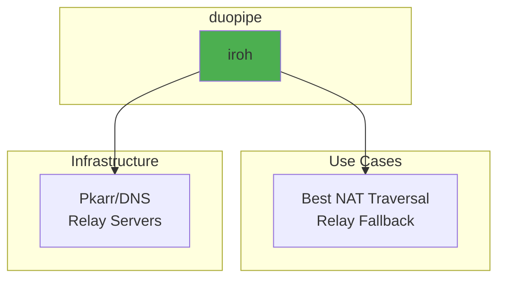

Relay-only (`relay_only`) is a config bool that forces connections through relay servers instead of attempting direct connections. It is intended for testing or special scenarios and requires at least one `relay_urls` entry.

### Core Components

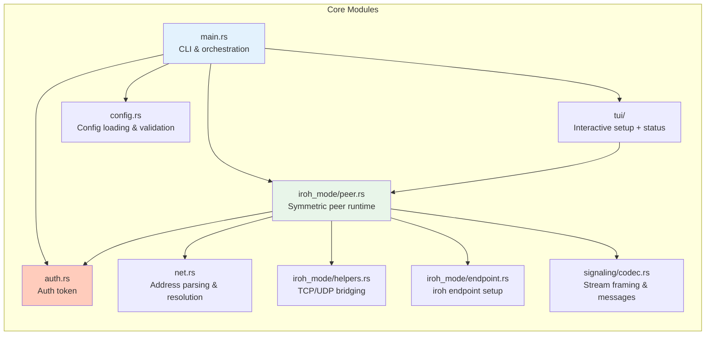

---

## Features

### Feature Summary

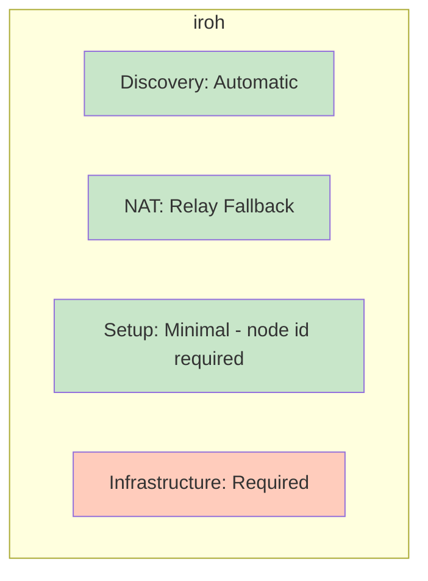

### NAT Traversal Capabilities

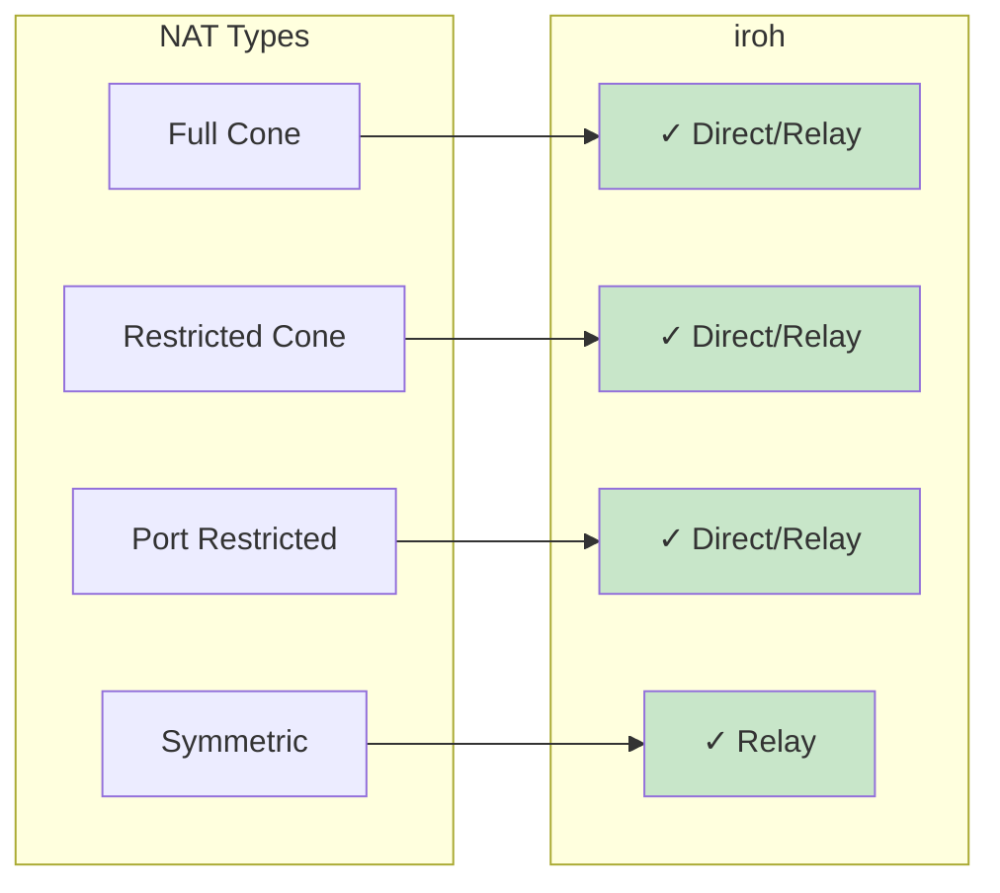

---

## iroh Mode Architecture

### Architecture Overview

Both ends run the same peer runtime (`duopipe quick` or `duopipe nostr`). The only asymmetry is who establishes the QUIC connection. Once authenticated, each peer runs **both** an accept-streams loop *and* its own request listeners, so tunnel requests (`[[request]]`) activated on either side all multiplex over the single connection.

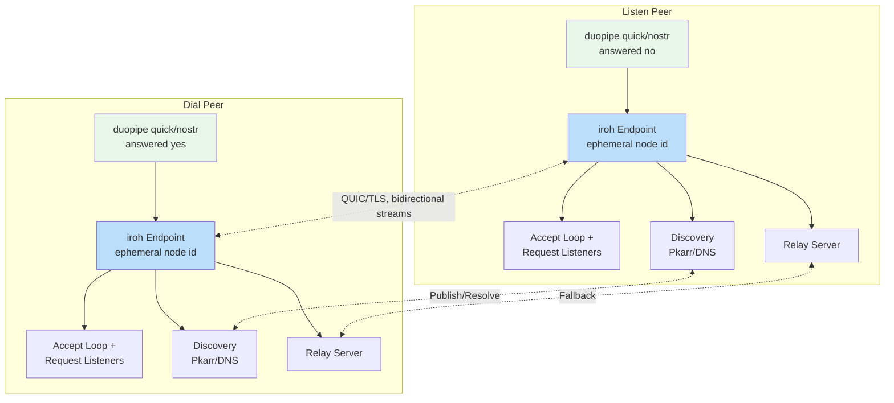

### Connection Establishment Flow

Connection setup is asymmetric (dialer + acceptor), but authentication is the *only* phase that distinguishes the two roles. After auth, the roles converge: both peers open and accept streams.

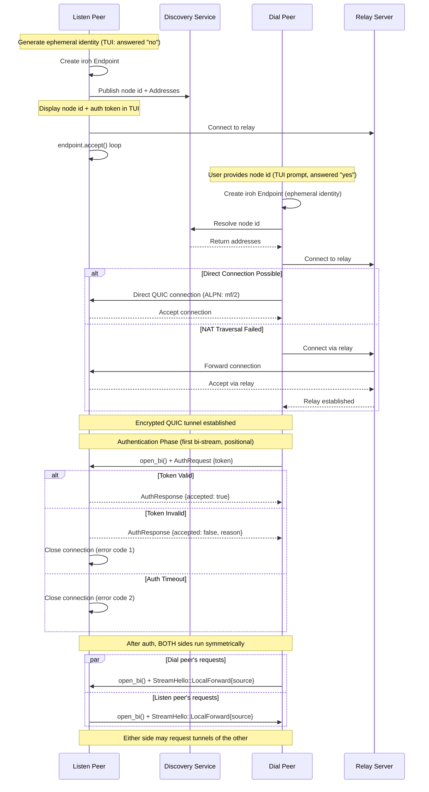

### Stream Dispatch (StreamHello)

The **auth stream is the only stream that does not carry a hello** — it is positional (the first bi-stream the dialer opens). Every *other* bidirectional stream begins with a self-describing [`StreamHello`] frame written by the stream **opener**, so the **acceptor** can route it without positional assumptions. There is now a single non-auth stream kind: `StreamHello::LocalForward { source }`, a tunnel request.

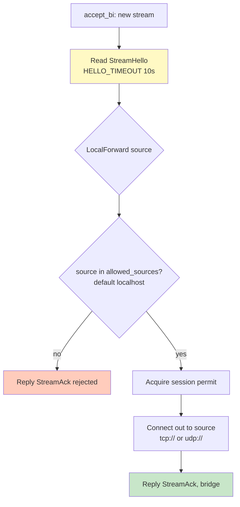

A single global `Semaphore` (default `max_streams = 100`), shared across all connected peers, bounds concurrent forwarded **data** streams in both directions (surfaced in the TUI as the `streams` gauge). The auth stream does not consume a permit. A timeout (`HELLO_TIMEOUT`) guards the `StreamHello` read so a stalled opener cannot pin a permit. The CIDR allowlist check runs **before** a permit is acquired, so rejected sources never consume one; if the limit is reached the acceptor replies with a rejecting `StreamAck` instead of bridging.

### Request Data Flow

A peer activates a request: it binds the local `local_listen` address and, per incoming connection, opens a stream tagged `StreamHello::LocalForward { source }`. The acceptor checks `source` against its `[allowed_sources]` allowlist, connects out (`tcp://host:port` or `udp://host:port`), replies `StreamAck`, then bridges. Requests start/stop on demand (TUI `Enter`, or `DUOPIPE_AUTOSTART_REQUESTS=1` in test mode); stopping one cancels its task and frees the bound port.

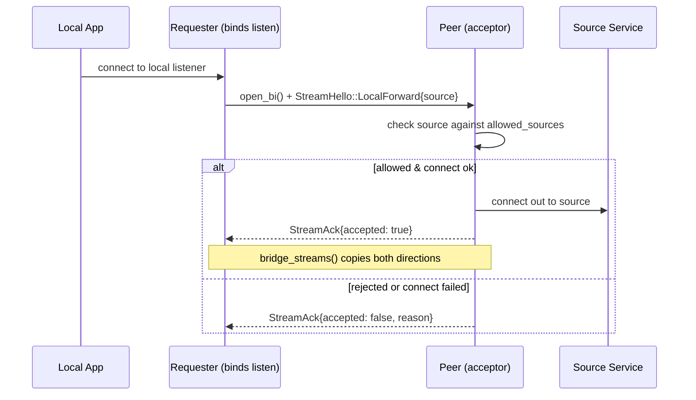

A request's listener is owned by a task with its own `CancellationToken`; a `Stop` command (or the connection closing) cancels it, dropping the `TcpListener`/`UdpSocket` and aborting in-flight bridged connections, which frees the bound port.

### TCP Tunnel Data Flow

TCP bridging uses `bridge_streams()` (`iroh_mode/helpers.rs`). The "opener" is the requesting peer that accepted the local connection; the "connect side" is the peer that dials the source.

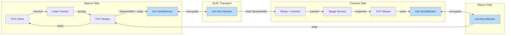

### UDP Tunnel Data Flow

UDP forwarding reuses `forward_stream_to_udp_server` / `forward_stream_to_udp_client` / `forward_udp_to_stream` (`iroh_mode/helpers.rs`) and works in both directions. Each UDP forward uses a single bidirectional stream; packets are length-prefixed (see [UDP Packet Framing](#udp-packet-framing)). On the connect side, UDP sockets are connected to the active target address so only datagrams from that target are returned over the stream; loopback targets also bind their local UDP socket to loopback.

> **Note:** A UDP request inherits a single-peer-address reply limitation — the connect side tracks one external peer address per stream for return packets.

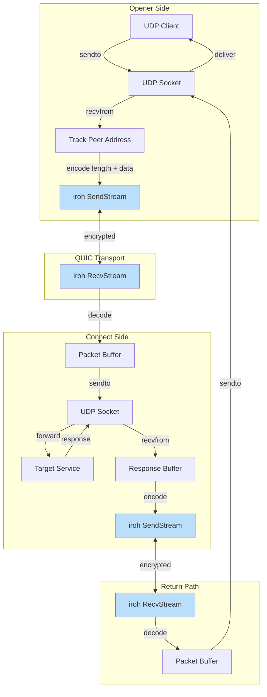

### Endpoint Management

Both the listen peer (`create_server_endpoint`) and the dial peer (`create_client_endpoint`) build their `iroh::Endpoint` through the same `create_endpoint_builder`, which configures QUIC transport tuning, relay mode, and discovery. Neither role provides a secret key — iroh generates a fresh ephemeral identity on every run, so the node id changes each run.

```mermaid
graph TB
    subgraph "Endpoint Creation"
        A[Generate ephemeral identity] --> B[Create Endpoint Builder]
        B --> B2[QUIC transport config:<br/>idle timeout 300s,<br/>keep-alive 15s,<br/>cc + window sizes]
        B2 --> C{Relay URLs?}
        C -->|Yes| D[Add Custom Relays]
        C -->|No| E[Use Default Relays]
        D --> F{Relay Only? (config bool)}
        E --> F
        F -->|Yes| G[clear_ip_transports]
        F -->|No| H[Keep IP + relay transports]
        G --> I{DNS Server?}
        H --> I
        I -->|none| J2[Disable DNS discovery]
        I -->|custom| J[Add Pkarr publisher/resolver]
        I -->|default| K[n0 Pkarr + DNS]
        J --> L[Add mDNS + Build]
        J2 --> L
        K --> L
    end

    subgraph "Discovery"
        L --> M[Publish to Pkarr/DNS]
        M --> N[Wait for endpoint online]
        N --> O[Endpoint Ready]
    end

    style A fill:#C8E6C9
    style L fill:#C8E6C9
    style O fill:#C8E6C9
```

---

## Configuration System

A single, symmetric `PeerConfig` drives the peer. There is no `role` enum and no `connect` key; the connection role is chosen **at startup** (interactively in the TUI, or via env vars for tests), not in config.

### Configuration File Structure

```mermaid
graph TB
    subgraph "Config File"
        A[peer.toml]
    end

    subgraph "Options"
        E[auth_token_file — path to the single shared token<br/>both peers]
        G[request[] {name, remote_source, local_listen}<br/>allowed_sources {tcp[], udp[]}]
        H[max_streams]
        I[relay_urls / relay_only / dns_server]
        J[transport<br/>cc + window sizes]
        K[name — peer identifier for nostr<br/>nostr_relay_urls]
    end

    A --> S[Validation]
    S --> E
    S --> G
    S --> H
    S --> I
    S --> J
    S --> K

    style S fill:#FFF9C4
```

The role (listen vs dial) and the dialer's target node id are not config fields. They are resolved at startup from the TUI prompts, or — for tests — from `DUOPIPE_PEER_NODE_ID` (set ⇒ dial, unset ⇒ listen) under `DUOPIPE_TEST_MODE=1`.

### iroh Credential Mapping

`iroh` mode uses a **single** shared credential, the auth token. The ALPN is a fixed constant (`mf/2`) and carries no credential.

| Credential | Env Var | Config Key | Expected Usage |
|------------|---------|-------------|----------------|
| **Auth Token** | `DUOPIPE_AUTH_TOKEN` | `auth_token_file` | Connection-level credential validated on the first bi-stream. Both peers use the **same** token: the dial peer **presents** it, the listen peer **accepts** exactly that one value. Also the rendezvous secret for nostr node-id discovery. |

Token precedence is `--auth-token-file` (CLI flag) > `DUOPIPE_AUTH_TOKEN` (env) > config `auth_token_file`. The token is supplied only via a file or env var — never written inline in the config. In configless mode (no config file) the listener generates an ephemeral token if none is supplied; nostr mode (a config file is loaded) requires a provided token and fails fast otherwise.

```toml
# peer.toml
auth_token_file = "/etc/duopipe/auth_token.txt"

[[request]]
name = "ssh"
remote_source = "tcp://127.0.0.1:22"
local_listen = "127.0.0.1:2222"
```

### Configuration Loading Flow

Config files are read by `duopipe nostr` and use TOML — settings are saved and reusable. The default path is `~/.config/duopipe/peer.toml`; `-c <path>` overrides it. `duopipe quick` reads no config: configuration comes from environment variables, the `--auth-token-file` flag, and interactive prompts only.

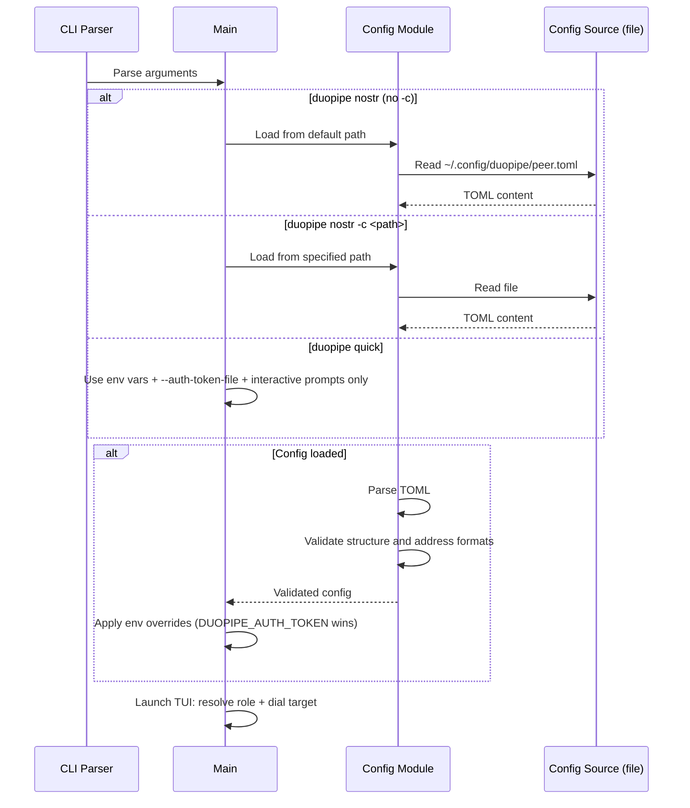

### Config Validation

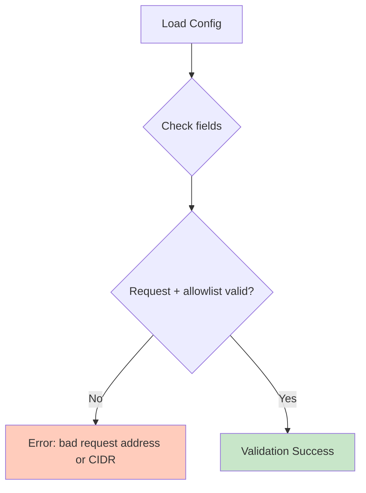

---

## Security Model

### Encryption Stack

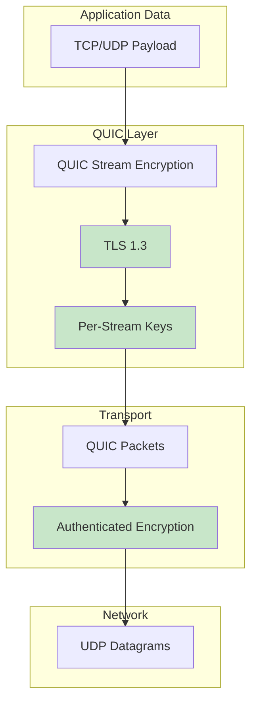

### Identity and Authentication

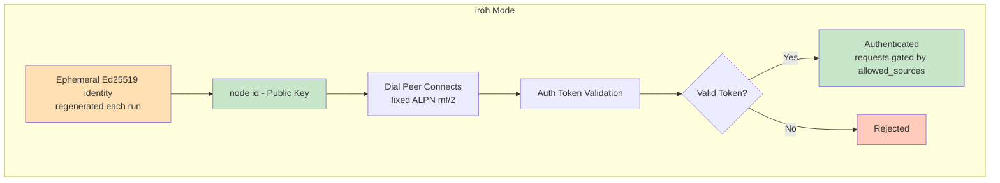

### Trust Model

**Your own devices, coordinated out-of-band.** duopipe is built for **one person linking devices they own** (laptop ↔ homelab box ↔ VPS) — not a public service or multi-tenant gateway. (Two parties who fully trust each other can use it too, but that is not the primary design point.) Several design choices follow directly from this assumption:

- **Out-of-band credential exchange.** The shared auth token is the same value placed on each of your devices, moved over a side channel you already have (a password manager, an existing SSH session, a synced secrets store). The ephemeral node id changes every run, but it no longer needs hand-copying: it is published to and looked up from nostr, keyed off that same shared token (see [Node-id discovery](#node-id-discovery-nostr)).
- **Interactive, operator-driven runtime.** Each device runs the TUI and watches shared status — connection state, every connected peer, and per-tunnel health — and start/stop tunnels manually. Coordination of *what* to expose and *when* is done by you (one person across your screens), not automatically.
- **Trust assumed between your devices.** Because either peer may *request* tunnels of the other once authenticated, the token should only ever live on endpoints you control; the `[allowed_sources]` allowlist then bounds what the other end can actually reach.

**Multiple peers, per-peer tunnels (listen role).** A listener accepts **many concurrent dialers** over its one iroh endpoint — there is no single-peer session binding. Each authenticated connection gets its own `PeerSession` (`AppState::attach_peer`): an independent tunnel table seeded from the `[[request]]` template, its own command channel, and its own observed path. Because a tunnel binds a local port and is directed at exactly one connection, the listen dashboard carries a peer selector — `Tab` toggles focus between the peer list and the selected peer's tunnels, so a tunnel you start targets that peer. A dialer holds at most one peer (the listener it dialed); a listener holds one per connected device. The single `max_streams` cap is **global**, shared across all peers.

The only admission guard left is transient: a **second concurrent connection from a node id that already has a live session** is refused as busy (`PEER_BUSY_CODE`) so a reconnect race cannot bind the same local ports twice; that dialer retries with backoff and gets back in once its old connection clears. Different node ids are always admitted. A peer's runtime-added tunnels do not persist across a disconnect — its session re-seeds from the template on reconnect (consistent with the per-connection reset that has always happened).

**Auth, then a source allowlist.** Connection setup is asymmetric, but the request model is symmetric: once the shared auth token passes and the peer is admitted, either peer may *request* tunnels. A request asks the acceptor to connect out to a `source`; before connecting, the acceptor checks that source against its `[allowed_sources]` CIDR lists (separate for TCP and UDP). Empty or absent TCP or UDP lists default to dual-stack localhost (`127.0.0.0/8`, `::1/128`). Requests are additionally activated on demand from the TUI; nothing forwards until started. Only grant a peer the token if you trust it to reach the networks in your allowlist.

### Token Authentication (iroh Mode)

Access control rests on a single shared auth token. The ALPN is a fixed constant (`mf/2`) and carries no credential. After the QUIC/TLS handshake, the dialing peer must present a valid auth token on the **first bidirectional stream** (positional — this auth stream is the only stream that carries no `StreamHello`) within a 10-second timeout.

#### Auth Token

- **Auth Token** (`DUOPIPE_AUTH_TOKEN` env var / `auth_token_file`): A single shared connection-level token, validated on the first bi-stream. Both peers use the **same** value. In code it is a 47-char `i...` token.

1. **Listen Peer Configuration**: The listen peer is configured with the shared auth token (or, in configless mode, generates an ephemeral one if none is set, displaying it in the TUI).
2. **Dial Peer Configuration**: The dial peer is configured with — or interactively prompted for — the same shared token.
3. **Protocol Flow**: The dialer opens the first bidirectional stream and sends an `AuthRequest` positionally (no hello). **No tunnel streams are processed until authentication succeeds.**
4. **Validation**: The listen peer validates the presented token against its single accepted token within a 10-second timeout (`auth_as_listener`).
5. **Rejection**: An invalid token is rejected with an `AuthResponse` containing the rejection reason, and the connection is closed with an error code.

This validation prevents unauthorized peers from holding open connections or opening tunnel streams.

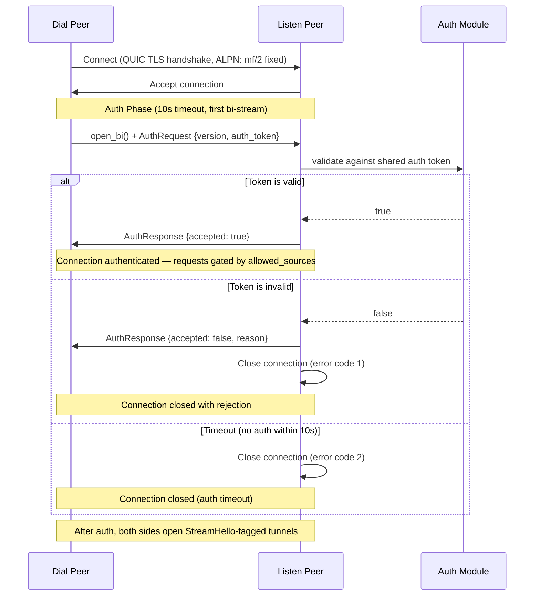

### Token Security Notes (iroh Mode)

- The token is a **bearer credential**: possession is sufficient for access. Rotate it if exposure is suspected.
- Token strength comes from **randomness, not format**: 32 random bytes (256 bits of entropy). Treat the token like a high‑entropy secret.
- The token is sent only **after** the QUIC/TLS 1.3 handshake, so the auth stream is encrypted in transit.
- The CRC16-CCITT-FALSE checksum is **for typo detection only**, not cryptographic security.
- The token is Base64URL-encoded and validated as ASCII.
- Avoid logging or sharing the token; the `AuthToken` wrapper redacts values in Debug output, but treat it like a password.
- Prefer a token file with restricted permissions (e.g., `0600`).

### Threat Model

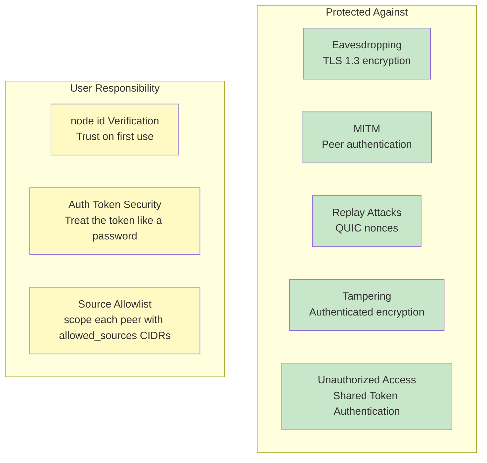

### Identity Management

The iroh identity is **ephemeral**: iroh generates a fresh Ed25519 keypair on every run, so there is no key file to store or protect. The consequence is that the **listen peer's node id changes every run** (the TUI displays the current node id). This avoids same-machine locking that could otherwise produce duplicate node ids. Instead of re-copying the node id by hand, peers discover it via nostr (below).

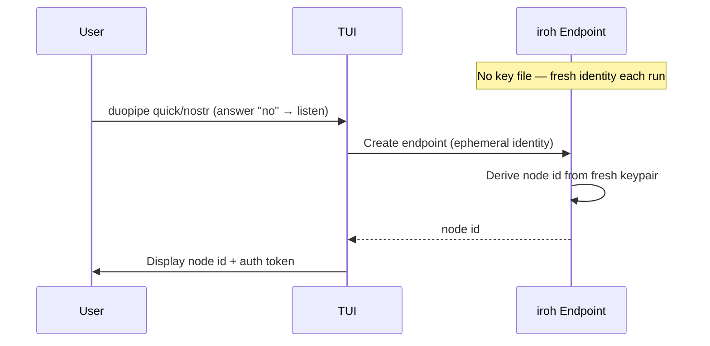

### Node-id discovery (nostr)

Because the node id is ephemeral, **nostr mode** (active whenever a config file is loaded) uses **nostr** as a side channel so the dialer can find the listener's *current* node id without a manual exchange. Configless mode (no config file) does not use nostr — the dialer enters the node id by hand. Implemented in `nostr_discovery.rs`:

- **Shared author key from the auth token.** Both peers derive the same nostr *author* keypair via `sha256("duopipe:nostr-rendezvous:v1" || auth_token)`. The token both sides share *is* the rendezvous, so discovery only works when it's shared (which the dialer needs anyway, for auth).
- **Per-peer `d` tag from the `name`.** Each peer is distinguished by its `name`: the `d` tag is `duopipe:nodeid:<sha256("duopipe:peer-id:v1" || auth_token || name)>` (`identifier_dtag`). Salting the hash with the auth token stops a short, low-entropy name from being guessed or enumerated on relays. Several peers can share one auth token and stay individually addressable; duplicate names just clobber (replaceable, newest wins).
- **Publish (listener).** `run_listen` spawns a background task that publishes a replaceable event (NIP-78 kind 30078, `d` tag = this peer's name tag, content = the current node id string) at startup and refreshes it every ~5 minutes. Relay failures are logged but non-fatal. Because the `d` tag is keyed on the stable name, a restart replaces the peer's own record — no stale accumulation.
- **Lookup on demand (dialer).** A nostr-mode dialer types the *target's* `name`; `run_dial` resolves it (filter by author = derived pubkey + kind + name's `d` tag, newest wins) at the top of *every* connect attempt, so a listener that restarted with a fresh node id self-heals on the next attempt. No persistent subscription.
- **Encrypted content.** The node id is encrypted (NIP-44) under the shared auth-token-derived keypair — self-encryption to the listener's own derived public key, so any peer with the same auth token derives the same key to decrypt — keeping it off relays in the clear. The auth token still gates the actual connection. Relays default to `DEFAULT_NOSTR_RELAYS`, overridable via `nostr_relay_urls`. To dial a raw node id without nostr, use quick mode.

Hermetic tests bypass nostr entirely: when `DUOPIPE_PEER_NODE_ID` is set the dialer dials that id directly, so the test suite needs no live relays.

---

## Protocol Support

### Signaling Protocol (signaling/codec.rs)

The signaling protocol is `IROH_MULTI_VERSION = 5`. All control messages are **length-prefixed JSON**: a `u32` big-endian length followed by the JSON body (capped at 16 KB). Each message embeds a `version` field that is validated on decode.

| Message | Direction | Carried On | Purpose |
|---------|-----------|------------|---------|
| `AuthRequest` / `AuthResponse` | dialer → listener / reply | first bi-stream (positional, no hello) | Connection-level token auth. |
| `StreamHello::LocalForward { source }` | requester → acceptor | first frame of a request data stream | Asks the acceptor to connect out to `source` (after the acceptor's `allowed_sources` check) and bridge. |
| `StreamAck { accepted, reason }` | acceptor → requester | per data stream | Acceptance reply once the acceptor passes the allowlist and connects out (or rejects/fails). |

### TCP Tunneling Architecture

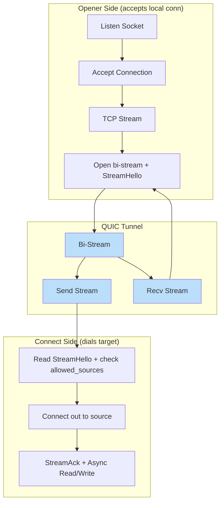

### UDP Tunneling Architecture

```mermaid
graph TB
    subgraph "Opener Side"
        A[UDP Socket] --> B[Receive Packet]
        B --> C[Track Peer Address]
        C --> D[Encode: u16 len + data]
    end

    subgraph "QUIC Tunnel"
        E[Single Bidirectional Stream]
        F[Send Stream]
        G[Recv Stream]
    end

    subgraph "Connect Side"
        H[Decode Packet]
        I[Send to Target]
        J[Receive Response]
        K[Encode Response]
    end
    
    subgraph "Return Path"
        L[Send via QUIC]
        M[Decode at Opener]
        N[Send to Peer Address]
    end
    
    D --> E
    E --> F
    F --> H
    H --> I
    I --> J
    J --> K
    K --> L
    L --> G
    G --> M
    M --> N
    N --> C
    
    style E fill:#BBDEFB
    style F fill:#BBDEFB
    style G fill:#BBDEFB
    style L fill:#BBDEFB
```

### UDP Packet Framing

```mermaid
graph LR
    subgraph "UDP Packet"
        A[Payload<br/>variable length]
    end
    
    subgraph "QUIC Stream Frame"
        B[Length<br/>u16 BE]
        C[Payload<br/>bytes]
    end
    
    subgraph "Decoding"
        D[Read 2 bytes]
        E[Parse length]
        F[Read N bytes]
        G[Reconstruct packet]
    end
    
    A --> B
    A --> C
    
    B --> D
    D --> E
    E --> F
    C --> F
    F --> G
    
    style B fill:#FFF9C4
    style C fill:#C8E6C9
```

---

## Component Details

### Endpoint (iroh)

The `iroh::Endpoint` provides:

- **Discovery**: Automatic peer discovery via Pkarr/DNS/mDNS
- **Relay**: Fallback relay servers for NAT traversal
- **QUIC**: Built-in QUIC transport with hole punching
- **Identity**: Ephemeral Ed25519 peer identity, regenerated each run

### Peer Runtime (iroh_mode/peer.rs)

`run_peer(PeerConfig)` is the single entry point. It validates relay-only usage and dispatches on `config.role` (resolved at startup from the TUI or env vars). The ALPN is the fixed `ALPN` constant.

- `run_listen` — `create_server_endpoint`, then an `endpoint.accept()` loop spawning `handle_connection(.., is_dialer = false)`. When `announce_endpoint` is set (non-interactive mode) it prints `node_id:` and `auth_token:` to stderr.
- `run_dial` — `create_client_endpoint` + `connect_to_server`, wrapped in a reconnect loop with exponential backoff (capped at 30s). Auth failures are fatal and stop the loop.

`handle_connection` authenticates (`auth_as_dialer` / `auth_as_listener`), then runs two concurrent halves over the one connection: an `accept_loop` (incoming requests from the peer, each gated by `check_source_allowed` against `allowed_sources` before connecting out) and a `request_supervisor` that starts/stops our own requests (`run_request`) on `TunnelCommand`s from the TUI, one `CancellationToken` per running request. Both halves use the global `max_streams` semaphore, shared across all peers. In test mode, `DUOPIPE_AUTOSTART_REQUESTS=1` starts that peer's template tunnels on connect. Everything is torn down when `conn.closed()` resolves, and the `PeerSession` is detached.

---

## Performance Considerations

### Connection Establishment Times

> **Note:** These are illustrative, environment-dependent ranges (network conditions, NAT type, relay availability, and DNS). Treat as rough guidance, not guarantees.

```mermaid
graph LR
    subgraph "iroh"
        A[Discovery: 1-3s]
        B[Connection: 0.5-2s]
        C[Total: 1.5-5s]
    end

    style C fill:#FFF9C4
```

### Throughput Characteristics

- **TCP Tunneling**: Limited by QUIC stream flow control and congestion control
- **UDP Tunneling**: Additional framing overhead (2 bytes per packet)
- **Relay Mode**: Higher latency, potentially lower throughput
- **Direct Mode**: Near-native performance with encryption overhead
- **Concurrency**: A single global semaphore caps concurrent forwarded data streams (`max_streams`, default 100) across both directions and all connected peers.

---

## Error Handling

### Connection Failures

```mermaid
graph TB
    A[Connection Attempt] --> B{Success?}
    B -->|Yes| C[Established]
    B -->|No| E{Relay available?}

    E -->|Yes| F[Fallback to relay]
    E -->|No| G[Connection failed]

    F --> C

    style C fill:#C8E6C9
    style F fill:#FFF9C4
    style G fill:#FFCCBC
```

### Exit Codes

The peer process uses categorized exit codes so wrapper scripts can distinguish
transient failures (retry) from permanent errors (stop). Note that the dial peer
has its own internal reconnect loop; the process only exits on fatal errors.

| Code | Category | Examples |
|------|----------|---------|
| 0 | Success | Normal termination |
| 1 | General error | Unexpected/uncategorized failures |
| 2 | Configuration | Missing/invalid node id, invalid token format, bad request address or `allowed_sources` CIDR |
| 3 | Authentication | Token rejected by peer, auth response timeout |
| 10 | Connection failed | Relay timeout, endpoint offline, peer unreachable |
| 11 | Connection lost | QUIC connection closed after tunnel was established |

Retry guidance:

- **Code 1** — Ambiguous. Retry a limited number of times with backoff; escalate if the error persists.
- **Codes 2, 3** — Do not retry. These require human intervention (fix config or credentials).
- **Code 10** — Connection establishment failed. Retry only if the tunnel has previously connected successfully.
- **Code 11** — Connection lost after the tunnel was working. Always safe to retry.

### Stream Errors

- **TCP**: Connection reset, timeout → close QUIC stream
- **UDP**: Packet loss → no retry (UDP semantics preserved)
- **QUIC**: Stream reset → close local TCP connection or stop UDP forwarding
- **Session limit reached**: acceptor replies with a rejecting `StreamAck`; opener-side TCP connections are dropped.

---

## Capabilities

| Feature | Support |
|---------|---------|
| Bidirectional tunnels | **Yes** — either peer may request tunnels of the other over one connection |
| Multi-Stream | **Yes** — many concurrent forwarded data streams per connection (`max_streams`) |
| Per-tunnel addresses | **Yes** — each `[[request]]` names its own `remote_source` / `local_listen` |
| Encryption | QUIC/TLS 1.3 |
| Platform | Linux, macOS, Windows |

---

## References

- [iroh Documentation](https://iroh.computer/)
- [RFC 9000 - QUIC](https://datatracker.ietf.org/doc/html/rfc9000)
</content>
</invoke>
