# duopipe Architecture

This document provides a comprehensive overview of the duopipe architecture, including detailed diagrams of component interactions, data flows, and security considerations.

## Table of Contents

- [System Overview](#system-overview)
- [Features](#features)
- [iroh Mode Architecture](#iroh-mode-architecture)
- [Configuration System](#configuration-system)
- [Security Model](#security-model)
- [Protocol Support](#protocol-support)
- [Component Details](#component-details)
- [Performance Considerations](#performance-considerations)
- [Error Handling](#error-handling)
- [Capabilities](#capabilities)
- [References](#references)

---

## System Overview

duopipe is a P2P SOCKS5-proxy tool using iroh for peer discovery, relay fallback, and encrypted QUIC transport. Once two devices are paired, each side can bind a loopback-only SOCKS5 proxy whose CONNECTs tunnel over the connection to reach services on the *other* device's network (modeled on flextunnel). UDP is intentionally out of scope and lives in a separate project (`../tunnel-rs`).

Binary: `duopipe`

> **Design Goal:** The project's primary goal is to let a **single user link their own devices** (laptop, homelab box, VPS, …) to reach services across them — for development or homelab purposes — without the hassle and security risk of opening a port. Both ends are expected to be machines the same person owns (or otherwise fully trusts). It is **not** meant for production setups, multi-user/multi-tenant access, or to be performant at scale. It is meant for **interactive use** (`duopipe quick` / `duopipe run` and the TUI); the non-interactive env-var override is a **test-mode-only** workaround (`DUOPIPE_TEST_MODE=1`), not a supported automation interface.

duopipe runs as a single peer binary, launched in one of two interactive modes — `duopipe quick` (configless) or `duopipe run` (config-driven) — each opening a ratatui TUI. There is no separate "server" and "client" binary mode. Interactively, the dashboard opens **idle**; the user presses **`Shift-L`** to start the **on-demand serve half**, OR presses **`Shift-C`** to dial a peer. A run holds **one pairing**: listening and dialing are mutually exclusive (a run is either the listener or the dialer of a single pairing, never both). Once paired, **each** side can bind its own loopback-only SOCKS5 proxy that reaches services on the *other* device's network; traffic on a proxied connection flows in both directions.

There is **no role prompt at startup**: the dashboard opens idle. `Shift-L` starts/stops the serve half (unavailable while a dial session exists); `Shift-C`/`Shift-D` connect/disconnect the dial session (unavailable while listening). For tests, the role is single and derived from environment variables (see [Non-interactive mode](#non-interactive-mode-testing)). The iroh identity is **ephemeral** — a fresh identity is generated each time the serve half starts, so a stop→start cycle (and every run) mints a new node id.

Internally the interactive runtime is `Role::Both`: a `run_serve_and_dial` that joins a `run_listen_supervisor` (the serve half, started on-demand when the user presses Shift+L — it idles until then) with a `run_dial_manager` (the dial session manager) over a shared `AppState` and stream semaphore. The two halves use separate iroh endpoints, but the one-pairing rule makes them mutually exclusive at runtime: `run_dial_manager` refuses to connect while listening and `run_listen_supervisor` refuses to start while a dial session exists (both gate on `AppState::can_dial`/`can_listen`, matching the TUI). The supervisor brings up `run_listen` under a child cancellation token on a `ListenCommand::Start` and tears it down on `Stop`. The listen endpoint owns the displayed/published node id. Single-role `Role::Listen`/`Role::Dial` exist only for the headless test path (and still auto-listen).

Config declares the local **SOCKS5 proxy port** (the dial target is chosen interactively at runtime, not here):

- **`socks_port`** (optional `u16`): the local, loopback-only (127.0.0.1 + ::1) port the SOCKS5 proxy binds once paired. The proxy is **symmetric** — either side can run its own. A local app pointed at the proxy issues SOCKS5 CONNECTs; each opens one QUIC stream and the *connected peer* connects out over TCP on its own network (domains resolve on that remote side), then bridges. CONNECT-only, no-auth-method, TCP-only (RFC 1928; no BIND/UDP). Activated on demand (TUI `s`, or `DUOPIPE_AUTOSTART_SOCKS=1` in test mode) — nothing binds automatically.

#### Non-interactive mode (testing)

The project is meant for interactive use, but for automated tests `DUOPIPE_TEST_MODE=1` runs the peer headless (no TUI) and gates all other test-only env vars:

- `DUOPIPE_TEST_MODE=1` — run headless; required to enable the vars below.
- `DUOPIPE_PEER_NODE_ID=<id>` — when set ⇒ dial that node id; when unset ⇒ listen.
- `DUOPIPE_AUTOSTART_SOCKS=1` — start the local SOCKS5 proxy on connect.
- `DUOPIPE_SOCKS_PORT=<port>` — seed the local SOCKS5 proxy port for config-free headless runs (0 = OS-assigned).
- `DUOPIPE_AUTH_TOKEN=<token>` — the shared auth token (in quick mode honored only here in test mode; also valid outside test mode in config mode).

In this mode the listener prints `node_id: <id>` and `auth_token: <token>` to **stderr** so a test harness can capture them and wire up the dialer.

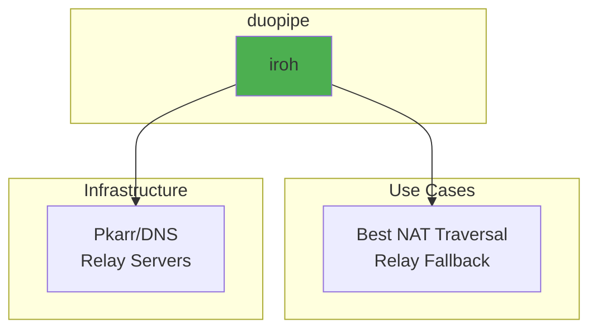

Relay-only (`relay_only`) is a config bool that forces connections through relay servers instead of attempting direct connections. It is intended for testing or special scenarios and requires at least one `relay_urls` entry.

### Core Components

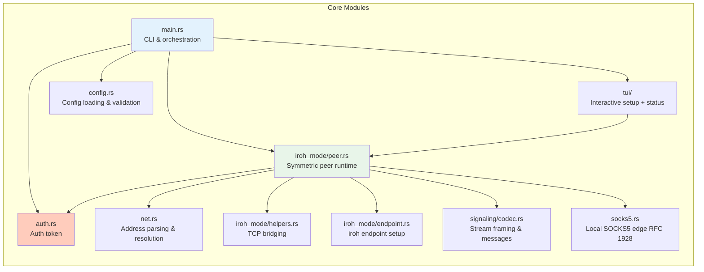

---

## Features

### Feature Summary

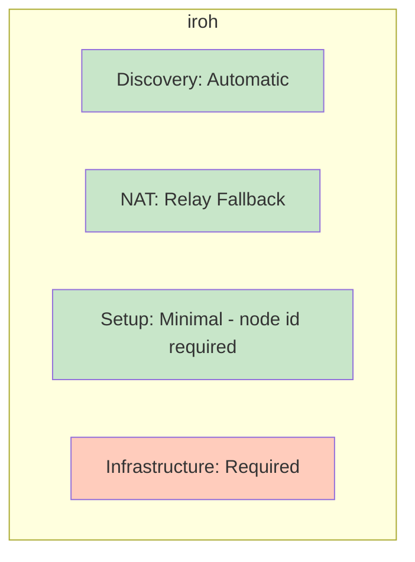

### NAT Traversal Capabilities

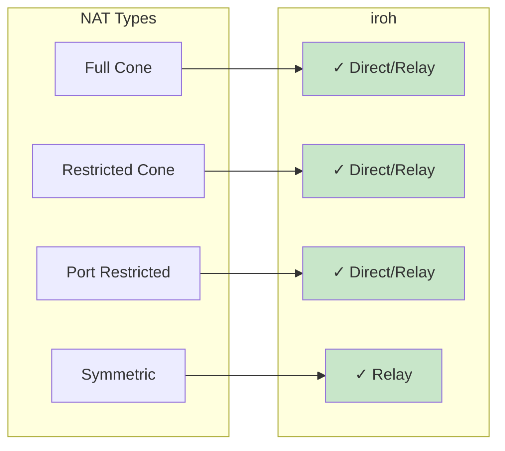

---

## iroh Mode Architecture

### Architecture Overview

Both ends run the same interactive peer runtime (`duopipe quick` or `duopipe run`): an on-demand serve half (started with `Shift-L`) OR one on-demand outbound dial session — a run is one or the other (one pairing per run). Connection setup is asymmetric (a dialer establishes the QUIC connection to a listener), but once auth passes the roles are symmetric for data: **either** side may bind a local SOCKS5 proxy and open connect-out streams, and **either** side accepts and bridges the peer's streams.

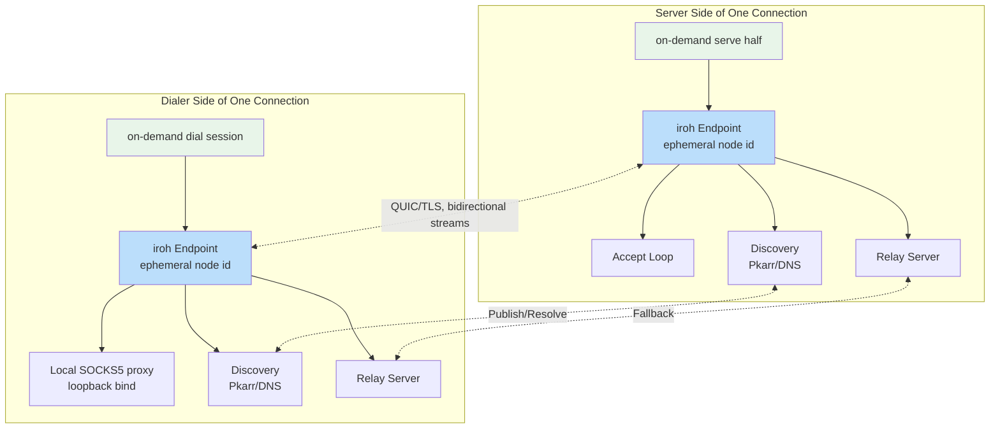

### Connection Establishment Flow

Connection setup is asymmetric (dialer + acceptor), but the proxy model is **symmetric**: after auth, either side may bind a local SOCKS5 proxy and open connect-out streams, and either side accepts and bridges the peer's streams. A run is either the listener or the dialer of the single pairing.

```mermaid
sequenceDiagram
    participant L as Listen Peer
    participant SD as Discovery Service
    participant D as Dial Peer
    participant RS as Relay Server

    Note over L: User presses Shift-L — serve half creates ephemeral identity
    L->>L: Create iroh Endpoint
    L->>SD: Publish node id + Addresses
    Note over L: Display node id + token/PIN banner/hint in TUI
    L->>RS: Connect to relay
    L->>L: endpoint.accept() loop

    Note over D: User presses Shift-C and enters node id or peer name
    D->>D: Create iroh Endpoint (ephemeral identity)
    D->>SD: Resolve node id or current name record
    SD-->>D: Return addresses
    D->>RS: Connect to relay

    alt Direct Connection Possible
        D->>L: Direct QUIC connection (ALPN: mf/2)
        L-->>D: Accept connection
    else NAT Traversal Failed
        D->>RS: Connect via relay
        RS->>L: Forward connection
        L-->>RS: Accept via relay
        RS-->>D: Relay established
    end

    Note over L,D: Encrypted QUIC tunnel established

    Note over D,L: Authentication Phase (first bi-stream, positional)
    D->>L: open_bi() + AuthRequest {token} (config/manual); AuthRequest::Pin challenge-response in quick PIN mode
    alt Token Valid
        L-->>D: AuthResponse {accepted: true}
    else Token Invalid
        L-->>D: AuthResponse {accepted: false, reason}
        L->>L: Close connection (error code 1)
    else Auth Timeout
        L->>L: Close connection (error code 2)
    end

    Note over D,L: After auth, a local SOCKS5 CONNECT opens one stream
    D->>L: open_bi() + StreamHello::SocksConnect{host, port}
    L-->>D: StreamAck{rep} + bridged traffic, or rejection
```

### Stream Dispatch (StreamHello)

The **auth stream is the only stream that does not carry a hello** — it is positional (the first bi-stream the dialer opens). Every *other* bidirectional stream begins with a self-describing [`StreamHello`] frame written by the stream **opener**, so the **acceptor** can route it without positional assumptions. There is a single non-auth stream kind: `StreamHello::SocksConnect { host, port }`, one relayed SOCKS5 CONNECT.

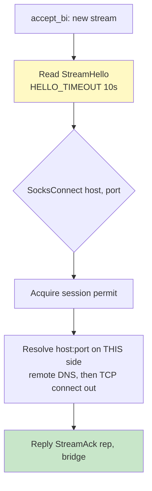

A single global `Semaphore` (default `max_streams = 100`) bounds concurrent proxied **data** streams in both directions (surfaced in the TUI as the `streams` gauge). The auth stream does not consume a permit. A timeout (`HELLO_TIMEOUT`) guards the `StreamHello` read so a stalled opener cannot pin a permit. If the limit is reached the acceptor replies with a rejecting `StreamAck` instead of bridging.

### SOCKS5 Data Flow

A peer starts its local proxy: it binds a loopback-only listener (127.0.0.1 + ::1) at `socks_port`. Per local SOCKS5 client it performs the RFC 1928 handshake (no-auth, CONNECT only), then opens a stream tagged `StreamHello::SocksConnect { host, port }`. The acceptor resolves `host` on **its own** network (domains resolve remotely), connects out over TCP, replies `StreamAck { rep }` carrying a SOCKS5 reply code, and bridges. The opener relays that `rep` verbatim into its local SOCKS5 reply. The proxy starts/stops on demand (TUI `s`/`x`, or `DUOPIPE_AUTOSTART_SOCKS=1` in test mode); stopping it cancels its task and frees the bound port.

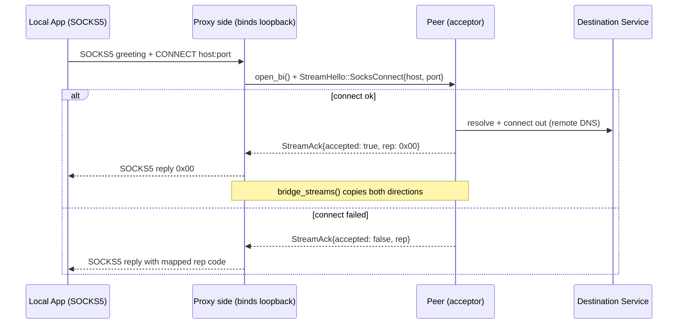

The proxy listener is owned by a task with its own `CancellationToken`; a `Stop` command (or the connection closing) cancels it, dropping the `TcpListener` and aborting in-flight bridged connections, which frees the bound port.

### Stream Data Flow

TCP bridging uses `bridge_streams()` (`iroh_mode/helpers.rs`). The "opener" is the proxy side that accepted the local SOCKS5 connection; the "connect side" is the peer that resolves and dials the destination.

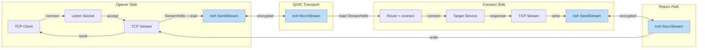

### Endpoint Management

Both the listen peer (`create_server_endpoint`) and the dial peer (`create_client_endpoint`) build their `iroh::Endpoint` through the same `create_endpoint_builder`, which configures QUIC transport tuning, relay mode, and discovery. Neither role provides a secret key — iroh generates a fresh ephemeral identity on every run, so the node id changes each run.

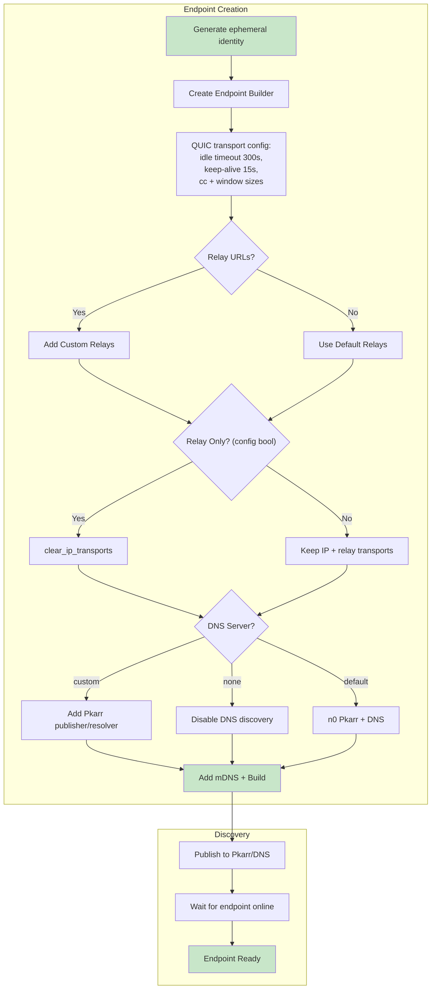

---

## Configuration System

A single, symmetric `PeerConfig` drives both halves of an interactive peer. There is no `role` key and no `connect` key: interactive runs always use the single combined serve+dial runtime, and the outbound dial target is chosen later from the dashboard. Only headless test mode derives a single listen/dial role from environment variables.

### Configuration File Structure

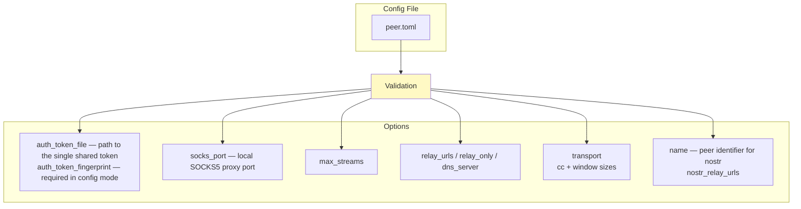

The outbound dial target is not a config field. In interactive mode it is entered at runtime from the connect prompt (`Shift-C`): a node id in quick mode or a peer `name` in config mode. In headless test mode only, `DUOPIPE_PEER_NODE_ID` under `DUOPIPE_TEST_MODE=1` selects the single role (set ⇒ dial, unset ⇒ listen).

### iroh Credential Mapping

`iroh` mode uses a **single** shared credential, the auth token — except quick **PIN** mode, which has no token and instead authenticates each connection with an in-band PIN challenge-response (see [Quick-mode PIN rendezvous](#quick-mode-pin-rendezvous)). The ALPN is a fixed constant (`mf/2`) and carries no credential.

| Credential | Env Var | Config Key | Expected Usage |
|------------|---------|-------------|----------------|
| **Auth Token** | `DUOPIPE_AUTH_TOKEN` | `auth_token_file` | Connection-level credential validated on the first bi-stream. Both peers use the **same** token: the dial peer **presents** it, the listen peer **accepts** exactly that one value. Also the rendezvous secret for nostr node-id discovery. |

Token precedence is `DUOPIPE_AUTH_TOKEN` (env) > config `auth_token_file`. A file token is never written inline in the config. **Quick mode** takes no existing-token input (`DUOPIPE_AUTH_TOKEN` is honored only in test mode, where the headless dial side needs it): its **manual** signaling generates a fresh ephemeral token in the setup screen, while its **PIN** signaling uses **no token at all** (the PIN authenticates the connection in-band). The generated token is surfaced in the dashboard header for copying in quick **manual** mode once the user starts listening (`Shift-L`); in quick **PIN** mode the token is never shown or shared — the PIN authenticates the connection in-band instead (see [Quick-mode PIN rendezvous](#quick-mode-pin-rendezvous)). **Config mode** accepts a token from config/env or pasted at setup (validated against its CRC before acceptance), since it is the pre-shared rendezvous secret both peers derive their key from and must be generated ahead of time (`duopipe generate-auth-token`); `auth_token_file` is therefore optional there too — only a `name` and `auth_token_fingerprint` are mandatory.

The TUI displays a short **token fingerprint** — `auth::token_fingerprint`, the first 4 bytes of the token string's SHA-256 rendered as 8 lowercase hex digits — in the header once the serve half is listening (gated on `snap.listening`) and in the `w`-dump. Because the full token is shown only briefly (and never on the dial side), the fingerprint lets the user confirm two devices share the same token without re-revealing the secret. The same canonical form also namespaces the per-name local state/lock file (`peer_state`): its path is `state-<fingerprint>-<name>.json`, with the `name` used verbatim (safe because `config::validate_name` restricts it to ASCII letters, digits, and `_`), so different pairings (tokens) that share a `name` get distinct, human-readable state files.

**Fingerprint pinning (config mode):** a config-mode config must declare `auth_token_fingerprint` (the same 8-hex-digit value) regardless of whether the token itself is in the config. The resolved token — from config, env, or pasted at setup — is checked against it (`auth::fingerprint_matches`): a file/env token is verified in `main::resolve_expected_fingerprint` before the TUI launches (a mismatch is a plain config error), and a pasted token is verified in the setup screen (`submit_token`). This disambiguates configs meant for different pairings, so pointing a config at the wrong token file is caught up front instead of failing as an auth error on connect. Quick mode declares no fingerprint.

```toml
# peer.toml
auth_token_file = "/etc/duopipe/auth_token.txt"
auth_token_fingerprint = "a1b2c3d4"   # required in config mode; must match the token above

socks_port = 1080   # local SOCKS5 proxy port (loopback only), started on demand
```

### Configuration Loading Flow

Config files are read by `duopipe run` and use TOML — settings are saved and reusable. The default path is `~/.config/duopipe/peer.toml`; `-c <path>` overrides it. `duopipe quick` reads no config and takes no options: quick **manual** mode generates its own ephemeral token while quick **PIN** mode uses none, and the dial target is entered interactively.

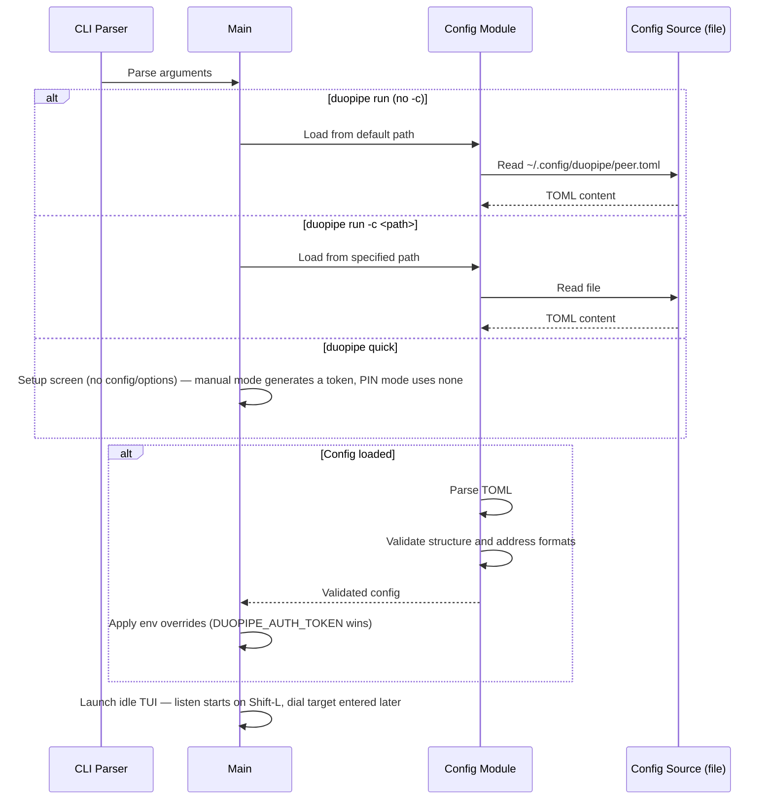

### Config Validation

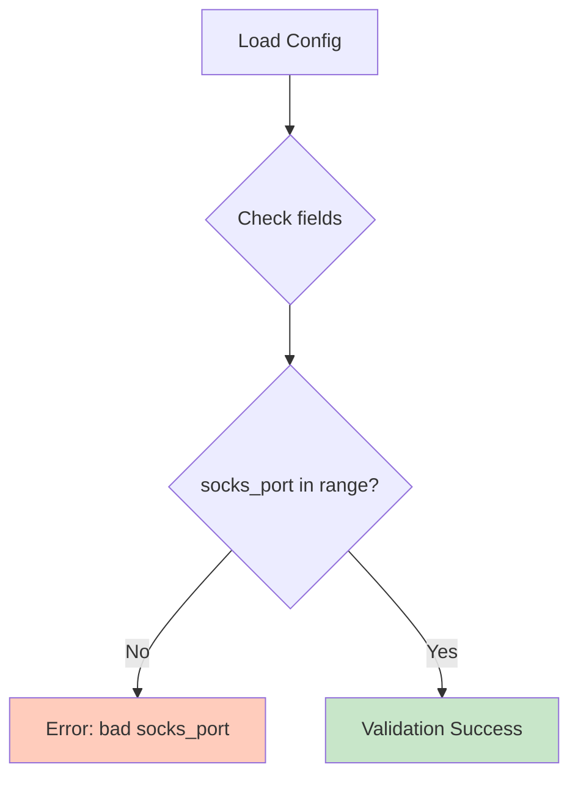

---

## Security Model

### Encryption Stack

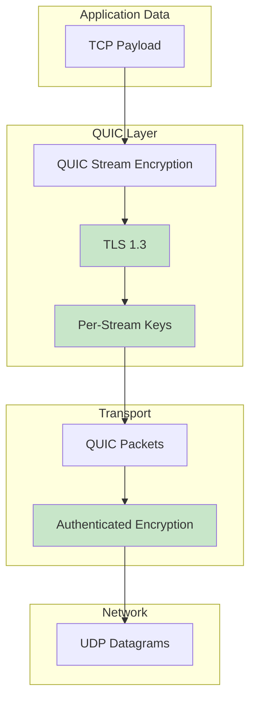

### Identity and Authentication

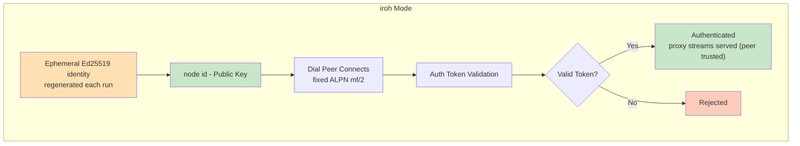

### Trust Model

**Your own devices, coordinated out-of-band.** duopipe is built for **one person linking devices they own** (laptop ↔ homelab box ↔ VPS) — not a public service or multi-tenant gateway. (Two parties who fully trust each other can use it too, but that is not the primary design point.) Several design choices follow directly from this assumption:

- **Out-of-band credential exchange.** In config and quick manual modes the shared **auth token** is the same value placed on each of your devices, moved over a side channel you already have (a password manager, an existing SSH session, a synced secrets store). The ephemeral node id changes every run, but in config mode it no longer needs hand-copying: it is published to and looked up from nostr, keyed off that same shared token (see [Node-id discovery](#node-id-discovery-nostr)). Quick **PIN** mode shares nothing out of band — the rotating PIN (shown on the listener, typed on the dialer) both locates the node id and authenticates the connection in-band (see [Quick-mode PIN rendezvous](#quick-mode-pin-rendezvous)).
- **Interactive, operator-driven runtime.** Each device runs the TUI and watches shared status — connection state, the paired peer, and proxy health — and starts/stops its SOCKS5 proxy manually. Coordination of *what* to reach and *when* is done by you (one person across your screens), not automatically.
- **Trust assumed between your devices.** Because either side's proxy can ask the peer to connect out once authenticated, the shared auth secret — the **auth token** in config and quick manual modes, or the rotating **PIN** in quick PIN mode — should only ever be exposed to endpoints you control. Once that secret passes, the connected peer is **fully trusted**: the acceptor will connect out to **any `host:port`** the peer's proxy asks for. Security rests **solely** on the shared secret plus the interactive activation; the proxy itself binds loopback-only, so only local apps on the proxying device can drive it.

**One pair per listen session (serve half).** The serve half pairs with a **single dialer** over its one iroh endpoint, for **all** modes (token and quick PIN) — this is the project's intent: one user linking their own devices, one pair at a time. The first peer to authenticate **claims** the endpoint by its node id (`PairClaim` in `iroh_mode/peer.rs`, held for the lifetime of one `run_listen`, i.e. one Shift+L Start→Stop); any *other* node id is then refused during auth (a clean rejection, not a silent drop) until the session is stopped. The claim is deliberately **not** released when the paired peer disconnects, so that peer — and only that peer — can reconnect without re-authenticating:

- **Token mode:** the same node id passes the claim gate and re-presents its token.
- **Quick PIN mode:** the key the peer paired with is retained on the claim and added to the candidate set on reconnect, so its proof still verifies after the PIN has rotated out of the recent-bucket cache; the dialer likewise caches the resolved node id (`pinned_pin_id`) so it reconnects by node id rather than re-resolving the rotated PIN on the relay.

A fresh listen session (Shift+L stop→start) mints a new ephemeral node id and a new, empty claim, so a different device can then pair. The pairing is surfaced inline in the TUI header (`AppState::mark_peer_connected` / `mark_peer_disconnected`, held as a single `InboundPeer`) — connected, or **reserved for `<node id>`** while the paired peer is disconnected — rather than in a multi-row peer list, since there is only ever one peer. `InboundPeer` refcounts the peer's live connections (`active_conns`), so a brief reconnect overlap (a new connection authenticating before the previous one finishes closing) never flickers to "disconnected"; the peer reads as disconnected only once its last connection is gone.

**Symmetric proxy, one pairing.** Connection setup is asymmetric (a dialer connects to a listener), but the proxy is symmetric: **either** side can bind its loopback-only SOCKS5 proxy and open connect-out streams, and **either** side accepts and connects out for the peer. Once authenticated, a side connects out to whatever `host:port` the peer's proxy asks for — the authenticated peer is fully trusted. A run holds one pairing (listening and dialing are mutually exclusive). The proxy binds only on `127.0.0.1`/`::1` and is activated on demand from the TUI; nothing binds until started. To reach a service on the *other* box, run your local SOCKS5 proxy and point an app at it. Only grant a peer the token if you trust it to reach any host each machine can route to.

### Token Authentication (iroh Mode)

Access control rests on a single shared auth token. (This section covers the token path used by config and quick manual modes; quick **PIN** mode instead runs an in-band PIN challenge-response — see [Quick-mode PIN rendezvous](#quick-mode-pin-rendezvous).) The ALPN is a fixed constant (`mf/2`) and carries no credential. After the QUIC/TLS handshake, the dialing peer must present a valid auth token on the **first bidirectional stream** (positional — this auth stream is the only stream that carries no `StreamHello`) within a 10-second timeout.

#### Auth Token

- **Auth Token** (`DUOPIPE_AUTH_TOKEN` env var / `auth_token_file`): A single shared connection-level token, validated on the first bi-stream. Both peers use the **same** value. In code it is a 47-char `i...` token.

1. **Listen Peer Configuration**: The listen peer is configured with the shared auth token (or, in configless manual mode, generates an ephemeral one and displays it in the TUI; configless **PIN** mode uses no token — the PIN authenticates the connection in-band).
2. **Dial Peer Configuration**: The dial peer is configured with — or interactively prompted for — the same shared token.
3. **Protocol Flow**: The dialer opens the first bidirectional stream and sends an `AuthRequest` positionally (no hello). **No data streams are processed until authentication succeeds.**
4. **Validation**: The listen peer validates the presented token against its single accepted token within a 10-second timeout (`auth_as_listener`).
5. **Rejection**: An invalid token is rejected with an `AuthResponse` containing the rejection reason, and the connection is closed with an error code.

This validation prevents unauthorized peers from holding open connections or opening data streams.

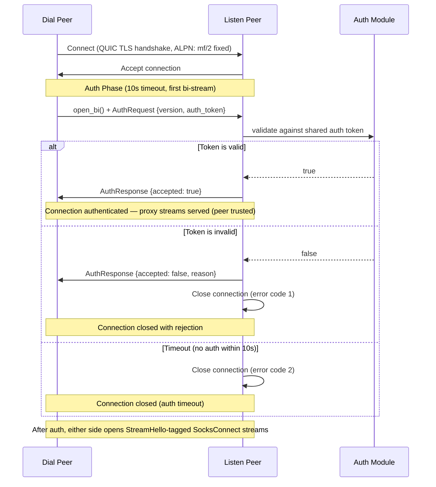

### Token Security Notes (iroh Mode)

- The token is a **bearer credential**: possession is sufficient for access. Rotate it if exposure is suspected.
- Token strength comes from **randomness, not format**: 32 random bytes (256 bits of entropy). Treat the token like a high‑entropy secret.
- The token is sent only **after** the QUIC/TLS 1.3 handshake, so the auth stream is encrypted in transit.
- The CRC16-CCITT-FALSE checksum is **for typo detection only**, not cryptographic security.
- The token is Base64URL-encoded and validated as ASCII.
- Avoid logging or sharing the token; the `AuthToken` wrapper redacts values in Debug output, but treat it like a password.
- Prefer a token file with restricted permissions (e.g., `0600`).

### Threat Model

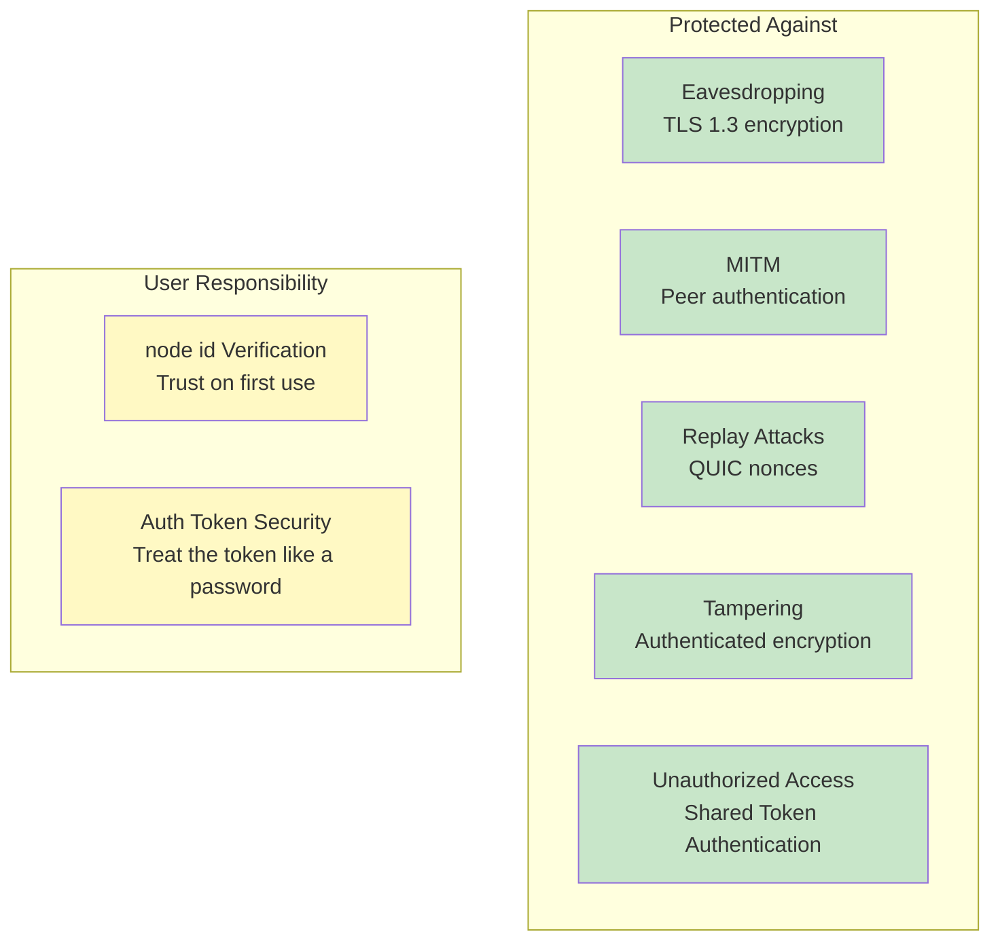

### Identity Management

The iroh identity is **ephemeral**: iroh generates a fresh Ed25519 keypair each time the serve half starts (the user presses `Shift-L`), so there is no key file to store or protect. The consequence is that the **listen peer's node id changes on every run — and on every stop→start cycle** (the TUI displays the current node id once listening). This avoids same-machine locking that could otherwise produce duplicate node ids. Instead of re-copying the node id by hand, peers discover it via nostr (below).

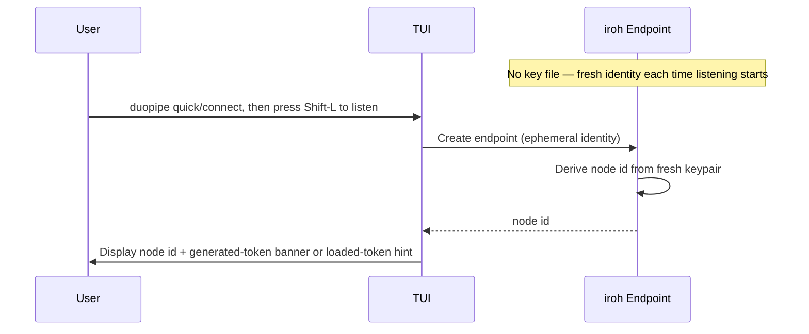

### Node-id discovery (nostr)

Because the node id is ephemeral, **config mode** (active whenever a config file is loaded) uses **nostr** as a side channel so the dialer can find the listener's *current* node id without a manual exchange. Configless **quick** mode offers two signaling choices at setup: a rotating **PIN** over nostr (see [Quick-mode PIN rendezvous](#quick-mode-pin-rendezvous) below) or **manual** copy-paste with nostr off (the dialer enters the node id by hand). The name-based discovery here is config mode's; it is implemented in `nostr_discovery.rs`:

- **Shared author key from the auth token.** Both peers derive the same nostr *author* keypair via `sha256("duopipe:nostr-rendezvous:v1" || auth_token)`. The token both sides share *is* the rendezvous, so discovery only works when it's shared (which the dialer needs anyway, for auth).
- **Per-peer `d` tag from the `name`.** Each peer is distinguished by its `name`: the `d` tag is `duopipe:nodeid:<sha256("duopipe:peer-id:v1" || auth_token || name)>` (`identifier_dtag`). Salting the hash with the auth token stops a short, low-entropy name from being guessed or enumerated on relays. Several peers can share one auth token and stay individually addressable; duplicate names just clobber (replaceable, newest wins).
- **Publish (listener).** `run_listen` spawns a background task that publishes a replaceable event (NIP-78 kind 30078, `d` tag = this peer's name tag, content = the current node id string) at startup and refreshes it every ~5 minutes. Relay failures are logged but non-fatal. Because the `d` tag is keyed on the stable name, a restart replaces the peer's own record — no stale accumulation.
- **Lookup on demand (dialer).** A nostr-mode dialer types the *target's* `name`; `run_dial` resolves it (filter by author = derived pubkey + kind + name's `d` tag, newest wins) at the top of *every* connect attempt, so a listener that restarted with a fresh node id self-heals on the next attempt. No persistent subscription.
- **Encrypted content.** The node id is encrypted (NIP-44) under the shared auth-token-derived keypair — self-encryption to the listener's own derived public key, so any peer with the same auth token derives the same key to decrypt — keeping it off relays in the clear. The auth token still gates the actual connection. Relays default to `DEFAULT_NOSTR_RELAYS`, overridable via `nostr_relay_urls`. To dial a raw node id without nostr, use quick mode.

Hermetic tests bypass nostr entirely: when `DUOPIPE_PEER_NODE_ID` is set the dialer dials that id directly, so the test suite needs no live relays.

### Quick-mode PIN rendezvous

Quick mode shares its **ephemeral node id** through nostr with no copy-paste, via a short rotating **PIN** — and the PIN then **authenticates the connection in-band**, so the auth token never touches a relay. Unlike config-mode discovery (keyed off the shared auth token), here the dialer starts with nothing but the PIN. PIN format/KDFs live in `pin.rs`; the relay record in `nostr_discovery.rs`; the in-band challenge-response in `pin_auth.rs`.

There are two independent PIN-derived keys, both Argon2id (64 MiB, t=3) over the canonical PIN but domain-separated by salt (`pin::derive_key_material` vs `pin::derive_auth_key_material`): a **rendezvous** key (salt includes the bucket) that locates & decrypts the relay record, and an **auth** key (`"duopipe:pin-auth:v1"`, **no** bucket) that seals the in-band proofs. The auth key is bucket-independent so the dialer derives it from the typed PIN without knowing the listener's bucket.

- **PIN format.** 8 Crockford-base32 characters (alphabet `0-9A-Z` minus the ambiguous `I L O U`), displayed UPPERCASE and grouped `XXXX-XXXX`. Input is normalized case-insensitively and ignores dashes/spaces (mapping the look-alikes `I`/`L`→`1`, `O`→`0`). The trailing character is a **check digit** — a position-weighted sum of the preceding chars mod 32 (mirroring `../secure-send-web`) — verified in `normalize_pin` so a typo is rejected before any KDF/lookup; the check digit adds no secrecy, leaving 7 random data characters (~35 bits). A fresh random PIN is minted per 60-second bucket.
- **Publish (listener).** When quick PIN mode is selected, `run_listen` spawns `run_pin_publisher`: each 60-second bucket it generates a PIN, sets it (plus the rollover deadline) on `AppState` for the header's refresh countdown, derives that PIN's auth key into a small **recent-PIN cache** (last `RECENT_PIN_CACHE = 3` buckets, shared with the listener auth path), and publishes a **regular (stored, non-replaceable) event** — kind `9421`, NIP-44-encrypted `{node_id}` content (node id only, **no token**), with a NIP-40 `expiration` a few buckets out so per-bucket records coexist for boundary look-back then self-clean. The lookup key is the **author pubkey** (only a holder of the PIN can derive it); no extra tag is needed. A different kind from config mode's replaceable 30078 is used deliberately so each bucket's record persists.
- **Display.** The PIN banner is shown like the manual-mode token banner: it **auto-hides after 10 minutes** (the header shows the absolute clock time it will hide), `h` toggles it off/on (re-showing re-arms the timer), and it hides once on the first inbound peer connect. The publisher keeps rotating in the background while hidden, so toggling back on shows the *current* PIN.
- **Lookup on demand (dialer).** A `DialTarget::Pin` resolves in the dial session: `lookup_pin_record` derives the rendezvous keypair for the current bucket and its two neighbors (covering the rotation boundary and small clock skew), queries all of them by author in one round-trip, then NIP-44-decrypts the newest matching record to the **node id** (no token).
- **In-band auth (`pin_auth.rs`).** After dialing that node id, both peers prove PIN possession on the first bi stream, using the same framing as token auth but a `AuthRequest::Pin` method: `D→L nonce_d`, `L→D nonce_l`, `D→L proof_d`, `L→D {accepted, proof_l}`. Each `proof` is a NIP-44 self-seal, under the PIN auth key, of `domain | direction | nonce_d | nonce_l`; a wrong PIN yields a wrong key and the seal fails to open (verified constant-time). The listener tries each recent-bucket key (so a code read just before a rotation still authenticates); the dialer verifies the listener's proof, giving **mutual** authentication. `auth_as_dialer_pin` / the `AuthRequest::Pin` arm of `auth_as_listener` wire this into `handle_connection` via the `AuthMode` enum; failures are `ErrorCategory::Auth` (fatal for the target, like a bad token). Nothing offline-crackable crosses the wire — the proofs are AEAD over random nonces on a channel iroh already encrypts and binds to the node id, so no PAKE is needed.
- **Trust.** The only thing on relays is the ephemeral node id (encrypted under the rendezvous key); the token is **never** published. Encrypting the node id is **defense in depth, not the security boundary** — the node id is not a credential (dialing it still requires passing the in-band PIN auth), so the encryption merely keeps ephemeral node ids off public relays in the clear, denying a PIN-less relay scraper the ability to harvest or correlate them. Cracking a captured record's short (~35-bit) PIN past Argon2id yields only a node id — not a credential — and by the time that slow crack finishes the **PIN has long since rotated**, so it can no longer authenticate an in-band connection (and the node id is likely dead too). Anyone who reads the current PIN *within its window* can still connect, so share it only with your own device. The 60-second rotation, short record TTL, and Argon2id cost bound the window; raising PIN length or KDF parameters tightens it further.

#### Future work (Option A): in-band token / device pairing

The in-band handshake above yields a channel that is both confidential (QUIC/TLS) and mutually PIN-authenticated — the natural place to *pair* devices. A future extension could, once that handshake succeeds, transmit the user's long-lived cross-device auth token (or other bootstrap material) over this same stream so the dialer can persist it — analogous to how `../secure-send-web` sends **file content** over its PIN/ECDH-established channel. Critically the token would travel only over the authenticated in-band channel and **never** touch a relay. Not implemented today: quick mode authenticates the session with the PIN and persists no token.

The PIN crypto round-trips and the full challenge-response handshake are unit-tested offline (`pin.rs`, `pin_auth.rs`, `nostr_discovery.rs`); no live-relay tests.

---

## Protocol Support

### Signaling Protocol (signaling/codec.rs)

The signaling protocol is `IROH_MULTI_VERSION = 7`. All control messages are **length-prefixed JSON**: a `u32` big-endian length followed by the JSON body (capped at 16 KB). Each message embeds a `version` field that is validated on decode.

| Message | Direction | Carried On | Purpose |
|---------|-----------|------------|---------|
| `AuthRequest` / `AuthResponse` | dialer → listener / reply | first bi-stream (positional, no hello) | Connection-level token auth. |
| `StreamHello::SocksConnect { host, port }` | opener → acceptor | first frame of a proxy data stream | Asks the acceptor to resolve+connect out over TCP to `host:port` on its own network (remote DNS) and bridge. |
| `StreamAck { accepted, rep, reason }` | acceptor → opener | per data stream | Acceptance reply carrying a SOCKS5 reply code (`rep`) that the opener relays into its local SOCKS5 reply. |

### SOCKS5 Tunneling Architecture

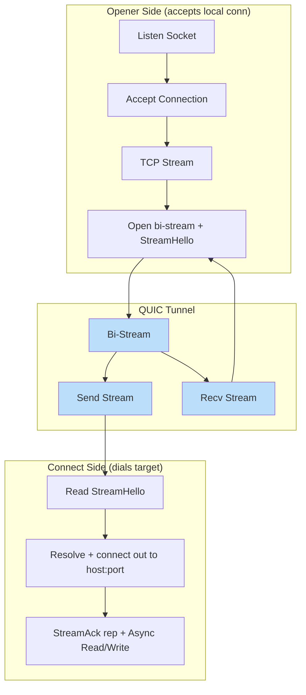

---

## Component Details

### Endpoint (iroh)

The `iroh::Endpoint` provides:

- **Discovery**: Automatic peer discovery via Pkarr/DNS/mDNS
- **Relay**: Fallback relay servers for NAT traversal
- **QUIC**: Built-in QUIC transport with hole punching
- **Identity**: Ephemeral Ed25519 peer identity, regenerated each run

### Peer Runtime (iroh_mode/peer.rs)

`run_peer(crate::iroh_mode::PeerConfig)` is the single runtime entry point. The TOML `crate::config::PeerConfig` has no serialized role; runtime `Role` is synthesized before this point by `ResolvedPeer`: interactive setup always builds `Role::Both`, while headless test mode infers `Role::Dial` when `DUOPIPE_PEER_NODE_ID` is present and `Role::Listen` otherwise. `build_peer_config` / `run_peer_headless` copy that synthesized role into the runtime config. Inside `run_peer`, that runtime role selects `run_serve_and_dial`, `run_listen`, or `run_dial`. The ALPN is the fixed `ALPN` constant.

- `run_listen` — `create_server_endpoint`, then an `endpoint.accept()` loop spawning `handle_connection(.., is_dialer = false)`. When `announce_endpoint` is set (non-interactive mode) it prints `node_id:` and `auth_token:` to stderr.
- `run_dial_manager` — interactive-only manager for the single outbound session. It reuses one client endpoint, idles until a `DialCommand::Connect`, and replaces or disconnects the active session on dashboard commands.
- `run_dial` — headless test path for a fixed target: `create_client_endpoint` + `connect_to_server`, wrapped in a reconnect loop with exponential backoff (capped at 30s). Auth failures are fatal and stop the loop.

`handle_connection` authenticates (`auth_as_dialer` / `auth_as_listener`), then — on **both** sides, since the proxy is symmetric — runs an `accept_loop` (incoming `SocksConnect` streams from the peer, each resolved and connected out over TCP; the peer is trusted post-auth, capped by the global semaphore) alongside a `socks_supervisor` that starts/stops the local SOCKS5 proxy (`run_socks_proxy`) on `SocksCommand`s from the TUI under a `CancellationToken`. In test mode, `DUOPIPE_AUTOSTART_SOCKS=1` starts the local proxy on connect. Everything is torn down when `conn.closed()` resolves; the listener also drops the peer from its list.

---

## Performance Considerations

### Connection Establishment Times

> **Note:** These are illustrative, environment-dependent ranges (network conditions, NAT type, relay availability, and DNS). Treat as rough guidance, not guarantees.

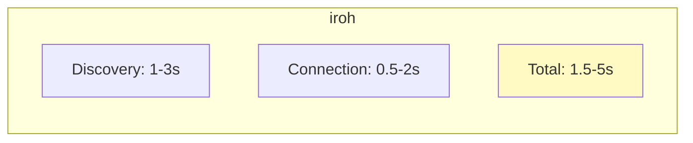

### Throughput Characteristics

- **TCP Tunneling**: Limited by QUIC stream flow control and congestion control
- **Relay Mode**: Higher latency, potentially lower throughput
- **Direct Mode**: Near-native performance with encryption overhead
- **Concurrency**: A single global semaphore caps concurrent forwarded data streams (`max_streams`, default 100) across both directions and all connected peers.

---

## Error Handling

### Connection Failures

```mermaid
graph TB
    A[Connection Attempt] --> B{Success?}
    B -->|Yes| C[Established]
    B -->|No| E{Relay available?}

    E -->|Yes| F[Fallback to relay]
    E -->|No| G[Connection failed]

    F --> C

    style C fill:#C8E6C9
    style F fill:#FFF9C4
    style G fill:#FFCCBC
```

### Exit Codes

The peer process uses categorized exit codes so wrapper scripts can distinguish
transient failures (retry) from permanent errors (stop). Note that the dial peer
has its own internal reconnect loop; the process only exits on fatal errors.

| Code | Category | Examples |
|------|----------|---------|
| 0 | Success | Normal termination |
| 1 | General error | Unexpected/uncategorized failures |
| 2 | Configuration | Missing/invalid node id, invalid token format, bad socks_port |
| 3 | Authentication | Token rejected by peer, auth response timeout |
| 10 | Connection failed | Relay timeout, endpoint offline, peer unreachable |
| 11 | Connection lost | QUIC connection closed after tunnel was established |

Retry guidance:

- **Code 1** — Ambiguous. Retry a limited number of times with backoff; escalate if the error persists.
- **Codes 2, 3** — Do not retry. These require human intervention (fix config or credentials).
- **Code 10** — Connection establishment failed. Retry only if the tunnel has previously connected successfully.
- **Code 11** — Connection lost after the tunnel was working. Always safe to retry.

### Stream Errors

- **TCP**: Connection reset, timeout → close QUIC stream
- **QUIC**: Stream reset → close local TCP connection
- **Session limit reached**: acceptor replies with a rejecting `StreamAck`; opener-side TCP connections are dropped.

---

## Capabilities

| Feature | Support |
|---------|---------|
| Symmetric SOCKS5 proxy | **Yes** — once paired, each side can bind a loopback-only SOCKS5 proxy reaching the other device's network |
| Bidirectional | **Yes** — either side may run its proxy and open connect-out streams; each proxied connection carries traffic both ways |
| Multi-Stream | **Yes** — many concurrent proxied data streams per connection (`max_streams`) |
| SOCKS5 scope | CONNECT only, no-auth method, ATYP ipv4/ipv6/domain (remote DNS); no BIND, no UDP ASSOCIATE (RFC 1928 subset) |
| UDP forwarding | **No** — intentionally out of scope; lives in a separate project (`../tunnel-rs`) |
| Encryption | QUIC/TLS 1.3 |
| Platform | Linux, macOS, Windows |

---

## References

- [iroh Documentation](https://iroh.computer/)
- [RFC 9000 - QUIC](https://datatracker.ietf.org/doc/html/rfc9000)
</content>
</invoke>
