# duopipe Architecture

This document provides a comprehensive overview of the duopipe architecture, including detailed diagrams of component interactions, data flows, and security considerations.

## Table of Contents

- [System Overview](#system-overview)
- [Features](#features)
- [iroh Mode Architecture](#iroh-mode-architecture)
- [Configuration System](#configuration-system)
- [Security Model](#security-model)
- [Protocol Support](#protocol-support)
- [Component Details](#component-details)
- [Performance Considerations](#performance-considerations)
- [Error Handling](#error-handling)
- [Capabilities](#capabilities)
- [References](#references)

---

## System Overview

duopipe is a P2P TCP/UDP port forwarding tool using iroh for peer discovery, relay fallback, and encrypted QUIC transport.

Binary: `duopipe`

> **Design Goal:** The project's primary goal is to provide a convenient way to connect to different networks for development or homelab purposes without the hassle and security risk of opening a port. It is **not** meant for production setups or designed to be performant at scale.

duopipe runs as a single, **symmetric peer**: `duopipe peer`. There is no separate "server" and "client" binary mode. Connection *setup* is asymmetric — QUIC needs one side to dial and the other to accept — but once a connection exists, **either side can open streams**, so tunnels flow in **both directions** over the one connection.

- The **listen peer** (`--connect listen`) has a stable secret identity and calls `endpoint.accept()` in a loop.
- The **dial peer** (`--connect dial`) knows the listener's `EndpointId` and connects to it, with an automatic reconnect loop (exponential backoff, capped). Its identity may be ephemeral.

Each peer can declare:

- **Local forwards** (`-L LISTEN=DEST`): this peer binds a local listener; each accepted connection is forwarded to a destination the *other* peer connects out to.
- **Remote forwards** (`-R BIND=DEST`): this peer asks the *other* peer to bind a listener and forward connections back to a destination *this* peer connects out to.

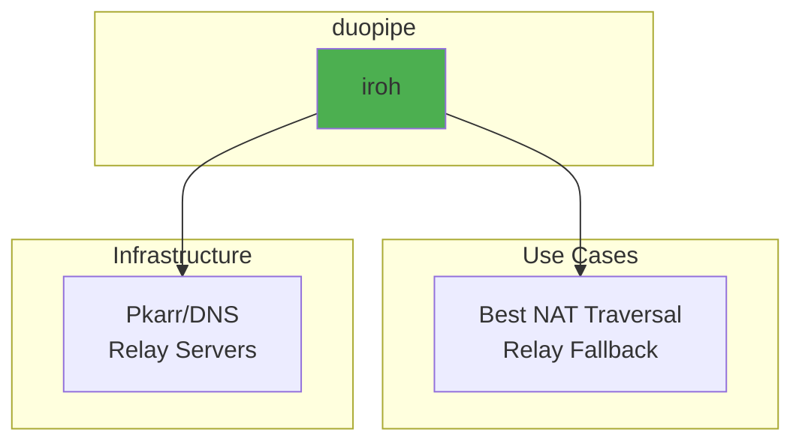

Relay-only is a CLI-only flag that forces connections through relay servers instead of attempting direct connections. It is intended for testing or special scenarios and is not supported in config files to avoid accidental activation. See `duopipe --help` for usage.

### Core Components

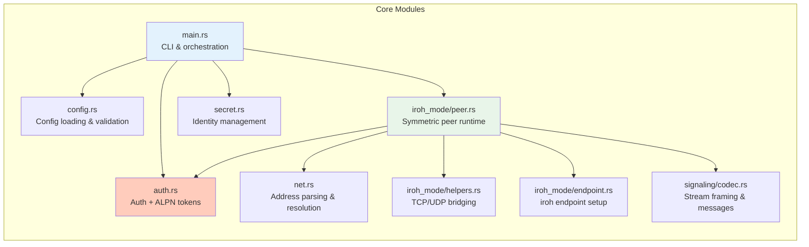

---

## Features

### Feature Summary

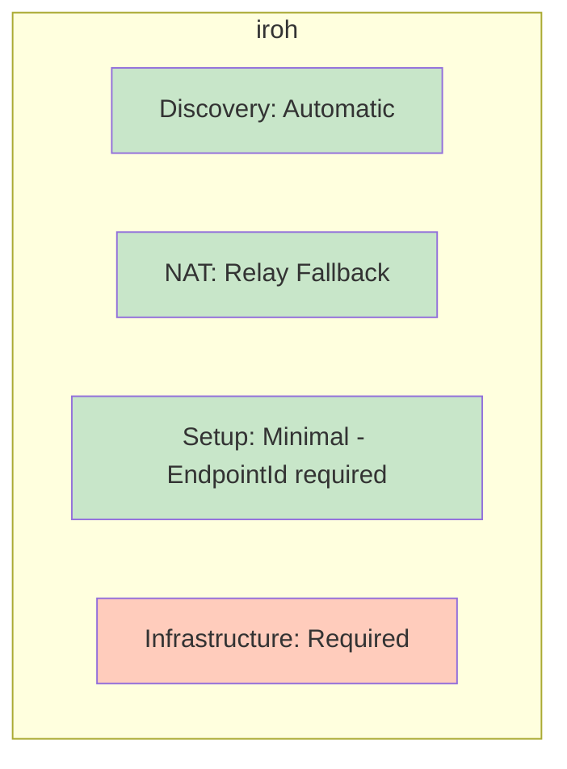

### NAT Traversal Capabilities

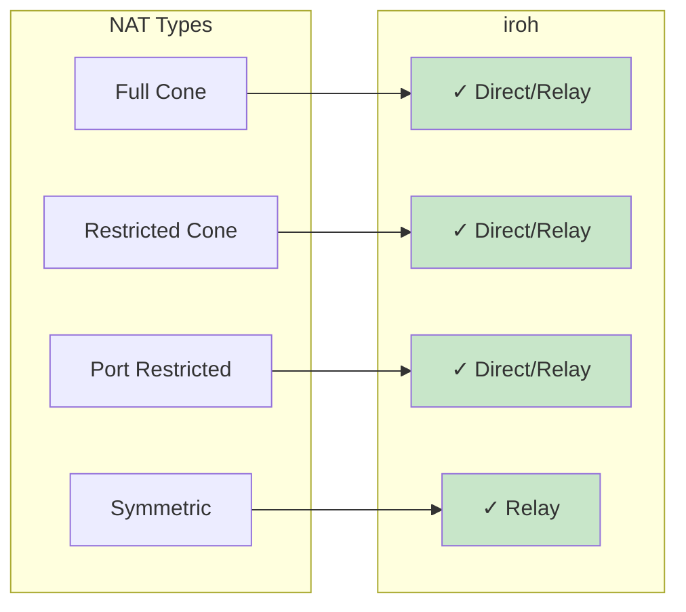

---

## iroh Mode Architecture

### Architecture Overview

Both ends run the same `duopipe peer` runtime. The only asymmetry is who establishes the QUIC connection. Once authenticated, each peer runs **both** an accept-streams loop *and* its own outbound listeners, so local forwards (`-L`) and remote forwards (`-R`) declared on either side all multiplex over the single connection.

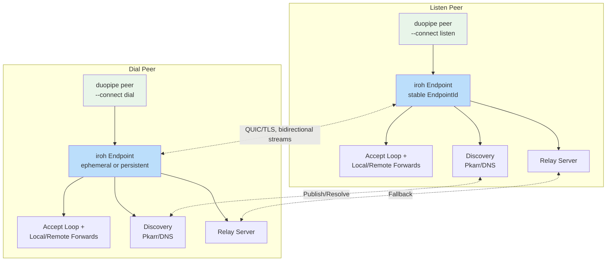

### Connection Establishment Flow

Connection setup is asymmetric (dialer + acceptor), but authentication is the *only* phase that distinguishes the two roles. After auth, the roles converge: both peers open and accept streams.

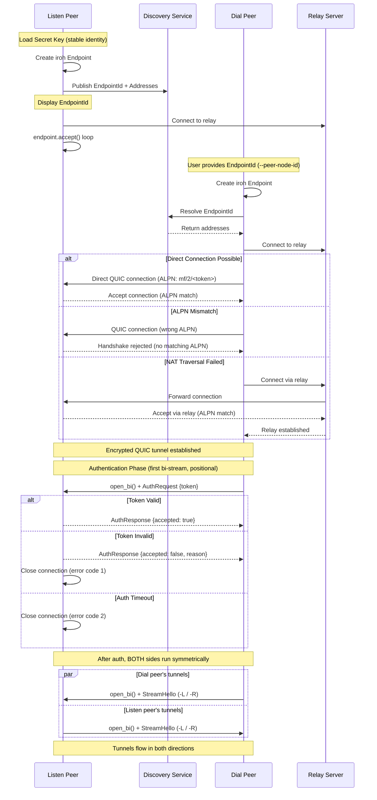

### Stream Dispatch (StreamHello)

The **auth stream is the only stream that does not carry a hello** — it is positional (the first bi-stream the dialer opens). Every *other* bidirectional stream begins with a self-describing [`StreamHello`] frame written by the stream **opener**, so the **acceptor** can route it without positional assumptions. This is what makes a symmetric peer possible: the side that accepts a stream doesn't need to know in advance whether it is a local-forward data stream, a remote-forward data stream, or a remote-forward control stream.

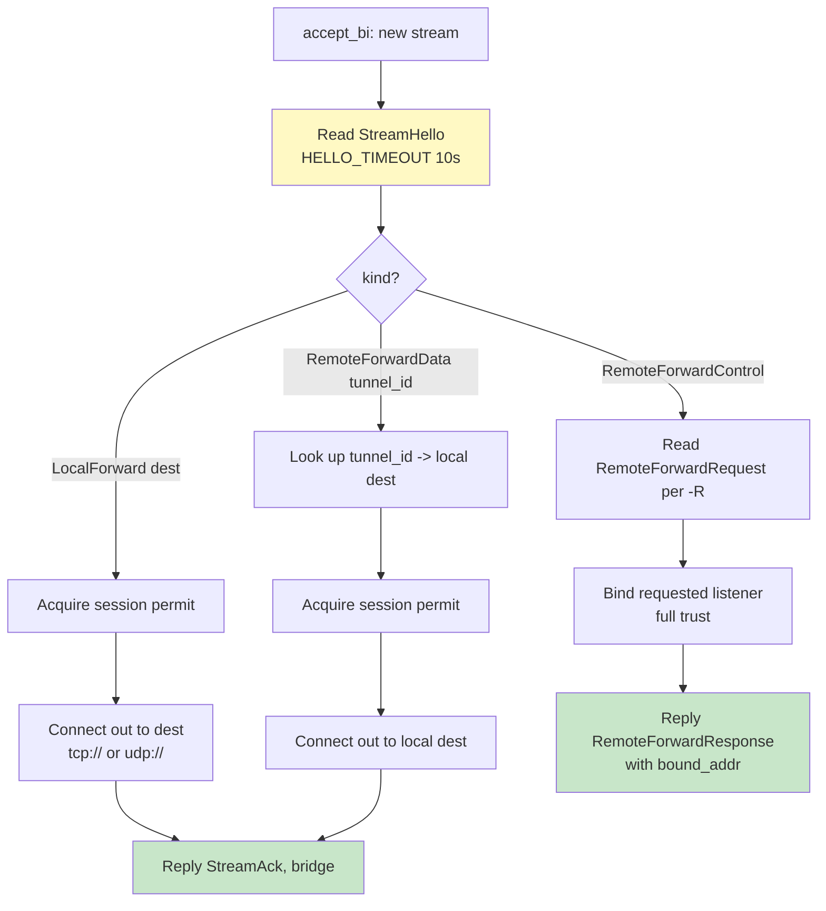

A per-connection `Semaphore` (default `max_sessions = 100`) bounds concurrent **data** streams in both directions. Auth and remote-forward *control* streams do not consume permits. A timeout (`HELLO_TIMEOUT`) guards the `StreamHello` read so a stalled opener cannot pin a permit; if the limit is reached the acceptor replies with a rejecting `StreamAck` instead of bridging.

### Local Forward (-L) Data Flow

The declaring peer binds a local listener. Per connection it opens a stream tagged `StreamHello::LocalForward { dest }`; the peer connects out to `dest` (`tcp://host:port` or `udp://host:port`), replies `StreamAck`, then bridges. This is the generalization of the old "one side opens a stream, the other connects out" path.

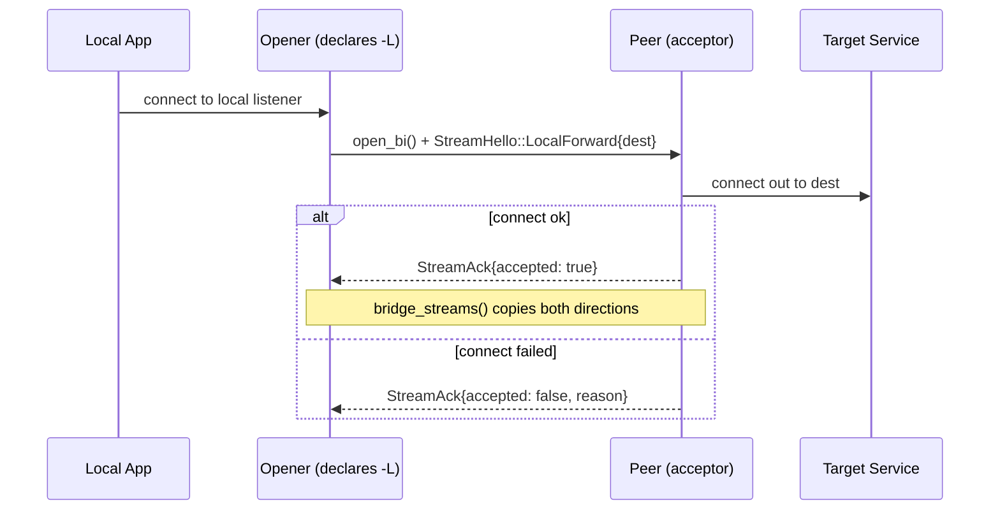

### Remote Forward (-R) Data Flow

The requester opens **one** control stream (`StreamHello::RemoteForwardControl`) and sends a `RemoteForwardRequest { tunnel_id, bind }` per `-R`. The host binds the requested listener (**full trust — no allowlist**), then replies `RemoteForwardResponse { accepted, bound_addr, ... }`. On each accepted connection, the host opens a fresh `StreamHello::RemoteForwardData { tunnel_id }` stream back; the requester maps `tunnel_id` to its own local `dest` and connects out.

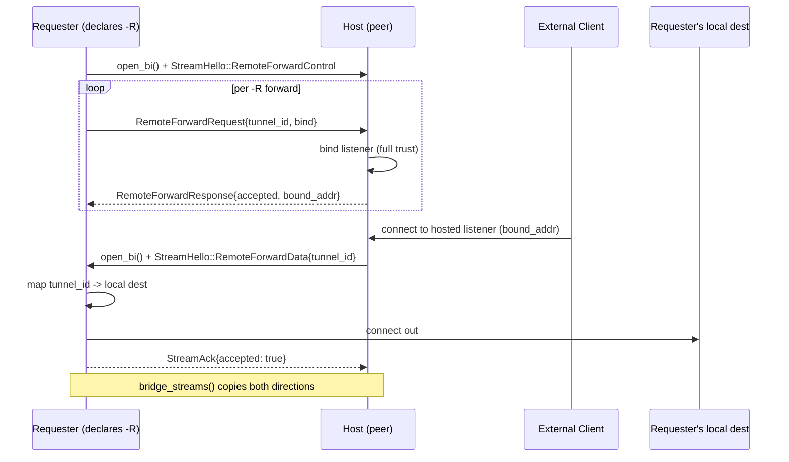

Tunnel ids are allocated by the requester via an `AtomicU64`. Hosted `-R` listeners self-terminate when the connection closes (a `tokio::select!` on `conn.closed()`), freeing the bound port.

### TCP Tunnel Data Flow

TCP bridging uses `bridge_streams()` (`iroh_mode/helpers.rs`) regardless of forward direction. The "opener" is whichever peer accepted the local connection; the "connect side" is whichever peer dials the target.

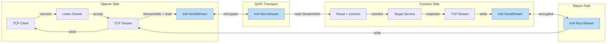

### UDP Tunnel Data Flow

UDP forwarding reuses `forward_stream_to_udp_server` / `forward_stream_to_udp_client` / `forward_udp_to_stream` (`iroh_mode/helpers.rs`) and works in both directions. Each UDP forward uses a single bidirectional stream; packets are length-prefixed (see [UDP Packet Framing](#udp-packet-framing)).

> **Note:** A hosted `-R` UDP forward inherits a single-peer-address reply limitation — the host tracks one external peer address per stream for return packets.

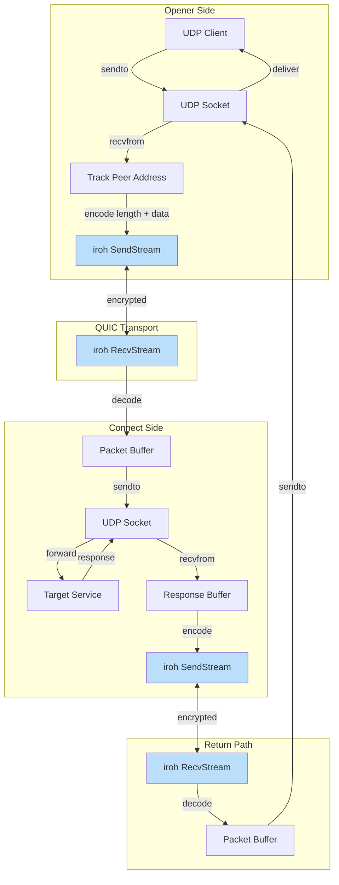

### Endpoint Management

Both the listen peer (`create_server_endpoint`) and the dial peer (`create_client_endpoint`) build their `iroh::Endpoint` through the same `create_endpoint_builder`, which configures QUIC transport tuning, relay mode, and discovery. The listen peer always provides a secret key (stable `EndpointId`); the dial peer may provide one or run with an ephemeral identity.

```mermaid
graph TB
    subgraph "Endpoint Creation"
        A[Load/Generate Secret] --> B[Create Endpoint Builder]
        B --> B2[QUIC transport config:<br/>idle timeout 300s,<br/>keep-alive 15s,<br/>cc + window sizes]
        B2 --> C{Relay URLs?}
        C -->|Yes| D[Add Custom Relays]
        C -->|No| E[Use Default Relays]
        D --> F{Relay Only? (CLI-only)}
        E --> F
        F -->|Yes| G[clear_ip_transports]
        F -->|No| H[Keep IP + relay transports]
        G --> I{DNS Server?}
        H --> I
        I -->|none| J2[Disable DNS discovery]
        I -->|custom| J[Add Pkarr publisher/resolver]
        I -->|default| K[n0 Pkarr + DNS]
        J --> L[Add mDNS + Build]
        J2 --> L
        K --> L
    end

    subgraph "Discovery"
        L --> M[Publish to Pkarr/DNS]
        M --> N[Wait for endpoint online]
        N --> O[Endpoint Ready]
    end

    style A fill:#FFE0B2
    style L fill:#C8E6C9
    style O fill:#C8E6C9
```

---

## Configuration System

A single, symmetric `PeerConfig` drives the peer. There is no `role` enum; the connection role is selected by the top-level `connect` key (`"dial"` or `"listen"`).

### Configuration File Structure

```mermaid
graph TB
    subgraph "Config File"
        A[mode: iroh]
    end

    subgraph "iroh Options"
        B[connect: dial / listen]
        C[peer_node_id<br/>dial only]
        D[secret / secret_file<br/>required for listen]
        E[auth_token* — dialer presents<br/>auth_tokens* — listener accepts]
        F[alpn_token* — both peers]
        G[local_forward[] {listen, dest} -L<br/>remote_forward[] {bind, dest} -R]
        H[max_sessions]
        I[relay_urls / dns_server]
        J[transport<br/>cc + window sizes]
    end

    A --> S[Validation]
    S --> B
    S --> C
    S --> D
    S --> E
    S --> F
    S --> G
    S --> H
    S --> I
    S --> J

    style S fill:#FFF9C4
```

The connection role and its role-specific requirements (`peer_node_id` + an auth token to present for `dial`; a secret identity + at least one accepted auth token for `listen`) are resolved and enforced in `main.rs` after merging CLI/env overrides, since those can supply the values.

### iroh Credential Mapping

`iroh` mode uses two distinct credential types:

| Credential | Env Vars / CLI Flags | Config Keys (TOML: use `_file` variants or age-encrypted inline) | Expected Usage |
|------------|-----------|-------------|----------------|
| **ALPN Token** | `DUOPIPE_ALPN_TOKEN` or `--alpn-token-file` | `alpn_token_file` or age-encrypted `alpn_token` | Pre-handshake QUIC ALPN filter (`mf/2/<token>`). One shared value for both peers. |
| **Auth Token** | Dial peer: `DUOPIPE_AUTH_TOKEN` or `--auth-token-file`<br>Listen peer: `DUOPIPE_AUTH_TOKENS` or `--auth-tokens-file` | Dial peer: `auth_token_file` or age-encrypted `auth_token`<br>Listen peer: `auth_tokens_file` or age-encrypted `auth_tokens` | Connection-level credential validated on the first bi-stream. The dial peer **presents** one token; the listen peer **accepts** a set. Use separate values per dialer for revocation/rotation. |

Example usage with files (recommended):

```bash
# Listen peer — save tokens to files with restricted permissions
echo "$ALPN_TOKEN" > alpn_token.txt && chmod 600 alpn_token.txt
printf '%s\n' "$ALICE_AUTH_TOKEN" "$BOB_AUTH_TOKEN" > auth_tokens.txt && chmod 600 auth_tokens.txt
duopipe peer --connect listen --secret-file ./peer.key \
  --alpn-token-file ./alpn_token.txt --auth-tokens-file ./auth_tokens.txt \
  -L 127.0.0.1:2222=tcp://127.0.0.1:22

# Alice's dial peer
echo "$ALICE_AUTH_TOKEN" > auth_token.txt && chmod 600 auth_token.txt
duopipe peer --connect dial --peer-node-id <ENDPOINT_ID> \
  --alpn-token-file ./alpn_token.txt --auth-token-file ./auth_token.txt \
  -L 127.0.0.1:8080=tcp://127.0.0.1:80
```

Example usage with environment variables:

```bash
# Listen peer
export DUOPIPE_ALPN_TOKEN="$ALPN_TOKEN"
export DUOPIPE_AUTH_TOKENS="$ALICE_AUTH_TOKEN,$BOB_AUTH_TOKEN"
duopipe peer --connect listen --secret-file ./peer.key ...

# Alice's dial peer
export DUOPIPE_ALPN_TOKEN="$ALPN_TOKEN"
export DUOPIPE_AUTH_TOKEN="$ALICE_AUTH_TOKEN"
duopipe peer --connect dial --peer-node-id <ENDPOINT_ID> ...
```

Example config usage (plaintext tokens are not allowed in TOML config files — use `_file` variants or age-encrypted inline values):

```toml
# peer-listen.toml — using _file variants
connect = "listen"
secret_file = "/etc/duopipe/peer.key"
alpn_token_file = "/etc/duopipe/alpn_token.txt"
auth_tokens_file = "/etc/duopipe/auth_tokens.txt"

[[local_forward]]
listen = "127.0.0.1:2222"
dest = "tcp://127.0.0.1:22"
```

```toml
# peer-dial.toml — using _file variants
connect = "dial"
peer_node_id = "<ENDPOINT_ID>"
alpn_token_file = "~/.config/duopipe/alpn_token.txt"
auth_token_file = "~/.config/duopipe/token.txt"

[[remote_forward]]
bind = "tcp://0.0.0.0:6574"
dest = "127.0.0.1:6574"
```

```toml
# peer-dial.toml — using age-encrypted inline values
connect = "dial"
peer_node_id = "<ENDPOINT_ID>"
encryption_key_file = "~/.config/duopipe/age.key"

auth_token = "ageenc:YWdlLWVuY3J5cHRpb24ub3JnL3Yx..."
alpn_token = "ageenc:YWdlLWVuY3J5cHRpb24ub3JnL3Yx..."
```

### Configuration Loading Flow

Configs are file-based (`-c`, `--default-config`) and use TOML — settings are saved and reusable. The default path is `~/.config/duopipe/peer.toml`. Without a config flag, configuration comes from CLI arguments and environment variables only.

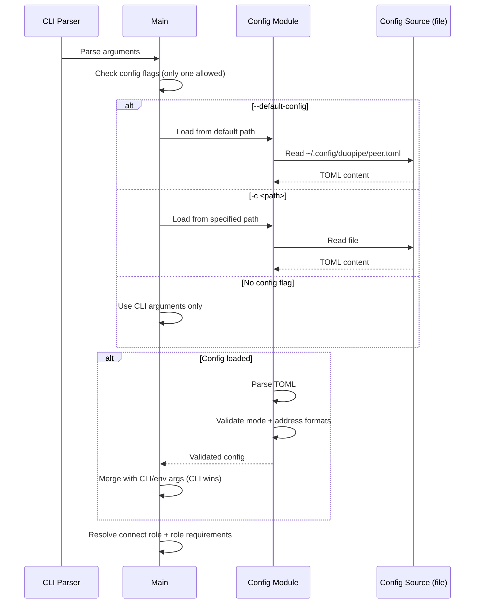

### Config Validation

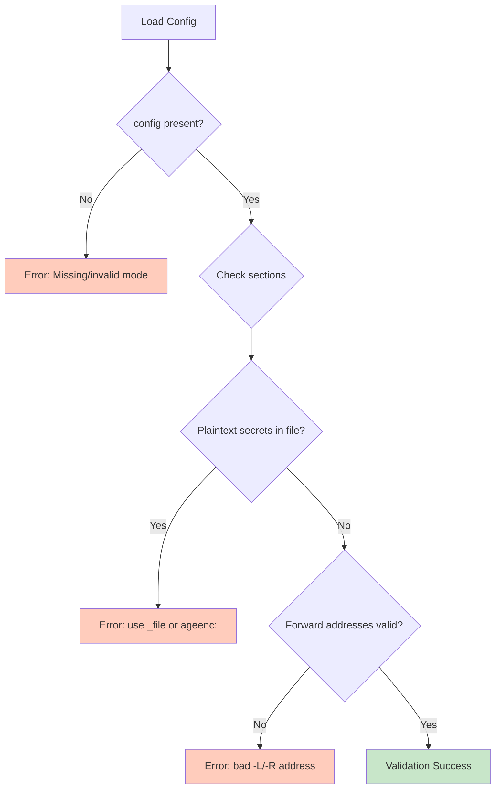

---

## Security Model

### Encryption Stack

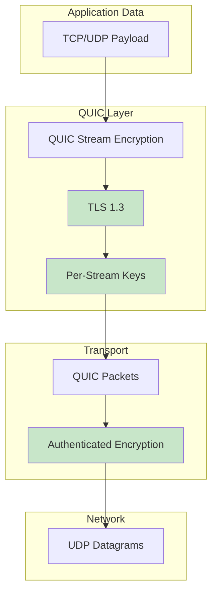

### Identity and Authentication

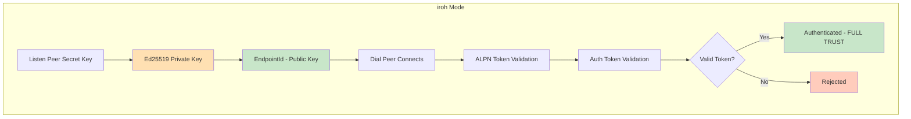

### Trust Model

**Full trust after authentication.** Connection setup is asymmetric, but trust is symmetric: once the ALPN + token handshake passes, the peer is fully trusted. There are **no per-destination allowlists** and no CIDR gating. A `-L` forward connects out to whatever `dest` the opener names, and a `-R` forward binds whatever listener the requester asks for. Only grant a peer access via a token you would trust with that level of network reach.

### Token Authentication (iroh Mode)

Iroh mode uses two layers of authentication. First, a pre-shared ALPN token is embedded in the QUIC protocol identifier (`mf/2/<token>`), rejecting unknown peers at the TLS handshake level before any application streams are opened. Second, the dialing peer must present a valid auth token on the **first bidirectional stream** (positional — this auth stream is the only stream that carries no `StreamHello`) within a 10-second timeout. **Both layers are mandatory.**

#### ALPN Token vs Auth Token

- **ALPN Token** (`DUOPIPE_ALPN_TOKEN` env var / `--alpn-token-file` / `alpn_token_file`): Pre-handshake shared value used for QUIC ALPN filtering. Both peers must use the same value.
- **Auth Token** (listen peer: `DUOPIPE_AUTH_TOKENS` env var / `--auth-tokens-file` / `auth_tokens_file`; dial peer: `DUOPIPE_AUTH_TOKEN` env var / `--auth-token-file` / `auth_token_file`): Connection-level token validated on the first bi-stream.
- **Mapping**: These are **distinct tokens**, not the same value. In code, ALPN tokens are 14-char Base64URL values, while auth tokens are 47-char `i...` tokens. Typical setup is one shared ALPN token plus per-dialer auth tokens for revocation.

1. **ALPN Filtering**: Both peers set `DUOPIPE_ALPN_TOKEN`. The token is embedded in the QUIC ALPN identifier (`mf/2/<token>`). Connections without a matching ALPN are rejected at the handshake level — acting as a lightweight "port knock".
2. **Listen Peer Configuration**: The listen peer sets `DUOPIPE_AUTH_TOKENS` with one or more accepted tokens (comma-separated), or `--auth-tokens-file`.
3. **Dial Peer Configuration**: The dial peer sets `DUOPIPE_AUTH_TOKEN` with the token it was issued.
4. **Protocol Flow**: The dialer opens the first bidirectional stream and sends an `AuthRequest` positionally (no hello). **No tunnel streams are processed until authentication succeeds.**
5. **Validation**: The listen peer validates the token using `is_token_valid()` within a 10-second timeout (`auth_as_listener`).
6. **Rejection**: Invalid tokens are rejected with an `AuthResponse` containing the rejection reason, and the connection is closed with an error code.

This layered validation prevents unauthorized peers from holding open connections or opening tunnel streams.

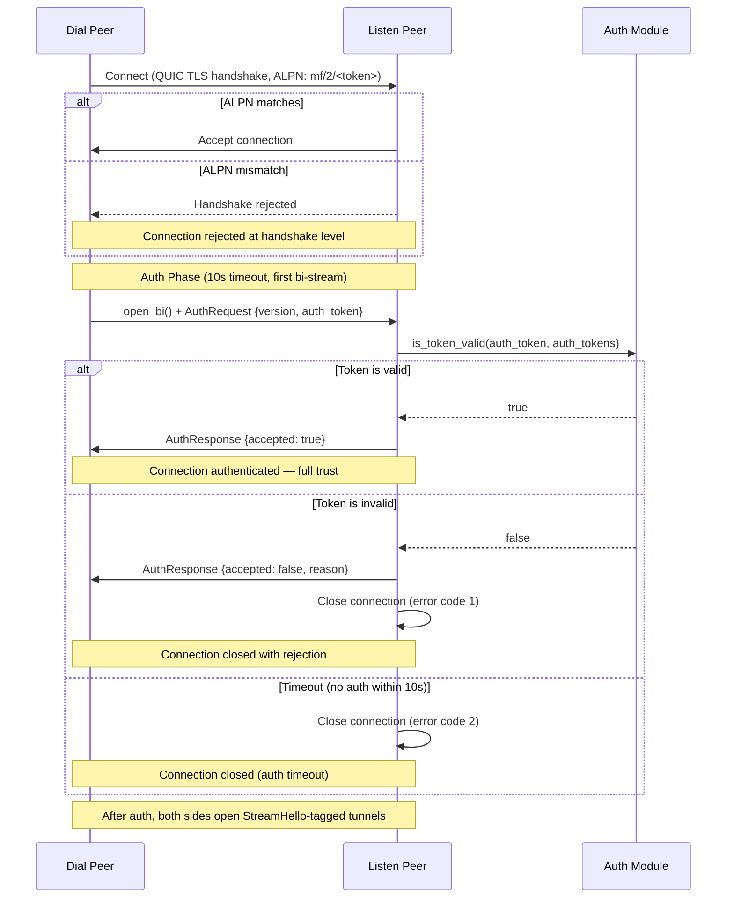

### Token Security Notes (iroh Mode)

- Tokens are **bearer credentials**: possession is sufficient for access. Use one token per dialer to enable revocation.
- Token strength comes from **randomness, not format**: 32 random bytes (256 bits of entropy). Treat tokens like high‑entropy secrets.
- Tokens are sent only **after** the QUIC/TLS 1.3 handshake, so the auth stream is encrypted in transit.
- The CRC16-CCITT-FALSE checksum is **for typo detection only**, not cryptographic security.
- Tokens are Base64URL-encoded and validated as ASCII.
- The **ALPN token** acts as a pre-handshake filter (lightweight "port knock"). It is embedded in the TLS ClientHello and therefore **visible in cleartext** on the wire — it is not a secret, but prevents casual scanners from completing a QUIC handshake.
- Avoid logging or sharing tokens; the `AuthToken` wrapper redacts values in Debug output, but treat them like passwords.
- Prefer token files with restricted permissions (e.g., `0600`) and rotate tokens if exposure is suspected.

### Threat Model

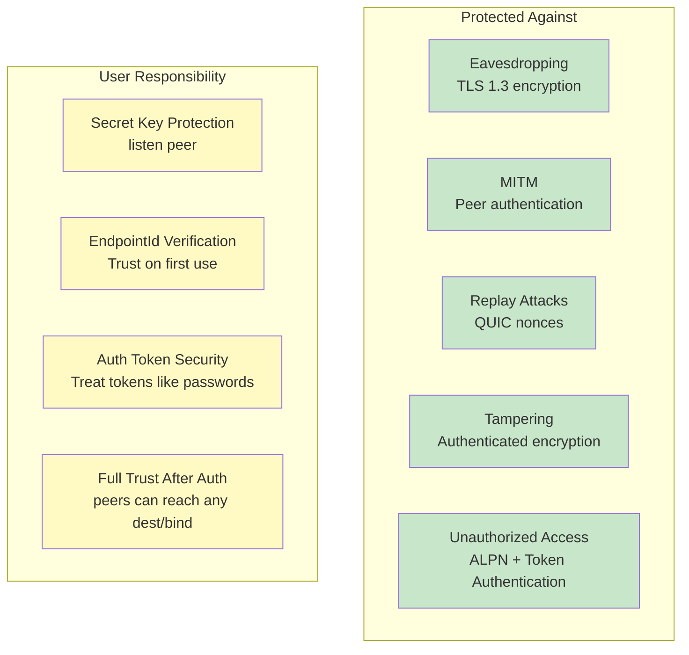

### Secret Key Management (Listen Peer)

The **listen peer** needs a persistent secret key to maintain a stable `EndpointId` that the dial peer connects to. The dial peer typically uses an ephemeral identity and authenticates via a token (it may optionally use a persistent key).

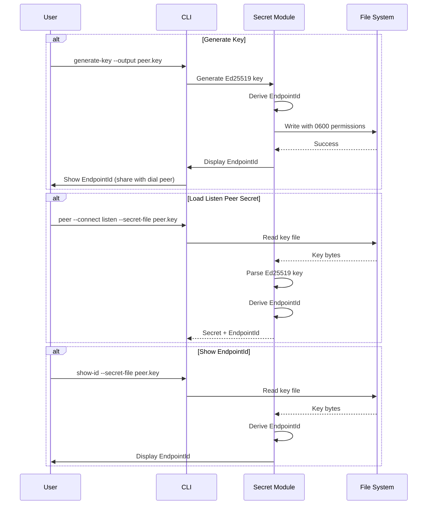

---

## Protocol Support

### Signaling Protocol (signaling/codec.rs)

The signaling protocol is `IROH_MULTI_VERSION = 4`. All control messages are **length-prefixed JSON**: a `u32` big-endian length followed by the JSON body (capped at 16 KB). Each message embeds a `version` field that is validated on decode.

| Message | Direction | Carried On | Purpose |
|---------|-----------|------------|---------|
| `AuthRequest` / `AuthResponse` | dialer → listener / reply | first bi-stream (positional, no hello) | Connection-level token auth. |
| `StreamHello::LocalForward { dest }` | opener → acceptor | first frame of a `-L` data stream | Asks the acceptor to connect out to `dest` and bridge. |
| `StreamHello::RemoteForwardData { tunnel_id }` | host → requester | first frame of a `-R` data stream | A connection arrived on a hosted listener; requester maps `tunnel_id` to its local dest. |
| `StreamHello::RemoteForwardControl` | requester → host | first frame of the `-R` control stream | Opens remote-forward negotiation. |
| `RemoteForwardRequest { tunnel_id, bind }` | requester → host | `-R` control stream | One per `-R`: asks the host to bind `bind`. |
| `RemoteForwardResponse { tunnel_id, accepted, reason, bound_addr }` | host → requester | `-R` control stream | Result of a bind, including the actual `bound_addr`. |
| `StreamAck { accepted, reason }` | acceptor → opener | per data stream | Acceptance reply once the acceptor has connected out (or failed). |

### TCP Tunneling Architecture

```mermaid
graph TB
    subgraph "Opener Side (accepts local conn)"
        A[Listen Socket] --> B[Accept Connection]
        B --> C[TCP Stream]
        C --> D[Open bi-stream + StreamHello]
    end

    subgraph "QUIC Tunnel"
        E[Bi-Stream]
        F[Send Stream]
        G[Recv Stream]
    end

    subgraph "Connect Side (dials target)"
        H[Read StreamHello + route]
        I[Connect to dest / local dest]
        J[StreamAck + Async Read/Write]
    end
    
    D --> E
    E --> F
    E --> G
    
    F --> H
    H --> I
    I --> J
    G --> D
    
    style E fill:#BBDEFB
    style F fill:#BBDEFB
    style G fill:#BBDEFB
```

### UDP Tunneling Architecture

```mermaid
graph TB
    subgraph "Opener Side"
        A[UDP Socket] --> B[Receive Packet]
        B --> C[Track Peer Address]
        C --> D[Encode: u16 len + data]
    end

    subgraph "QUIC Tunnel"
        E[Single Bidirectional Stream]
        F[Send Stream]
        G[Recv Stream]
    end

    subgraph "Connect Side"
        H[Decode Packet]
        I[Send to Target]
        J[Receive Response]
        K[Encode Response]
    end
    
    subgraph "Return Path"
        L[Send via QUIC]
        M[Decode at Opener]
        N[Send to Peer Address]
    end
    
    D --> E
    E --> F
    F --> H
    H --> I
    I --> J
    J --> K
    K --> L
    L --> G
    G --> M
    M --> N
    N --> C
    
    style E fill:#BBDEFB
    style F fill:#BBDEFB
    style G fill:#BBDEFB
    style L fill:#BBDEFB
```

### UDP Packet Framing

```mermaid
graph LR
    subgraph "UDP Packet"
        A[Payload<br/>variable length]
    end
    
    subgraph "QUIC Stream Frame"
        B[Length<br/>u16 BE]
        C[Payload<br/>bytes]
    end
    
    subgraph "Decoding"
        D[Read 2 bytes]
        E[Parse length]
        F[Read N bytes]
        G[Reconstruct packet]
    end
    
    A --> B
    A --> C
    
    B --> D
    D --> E
    E --> F
    C --> F
    F --> G
    
    style B fill:#FFF9C4
    style C fill:#C8E6C9
```

---

## Component Details

### Endpoint (iroh)

The `iroh::Endpoint` provides:

- **Discovery**: Automatic peer discovery via Pkarr/DNS/mDNS
- **Relay**: Fallback relay servers for NAT traversal
- **QUIC**: Built-in QUIC transport with hole punching
- **Identity**: Ed25519-based peer identity and authentication

### Peer Runtime (iroh_mode/peer.rs)

`run_peer(PeerConfig)` is the single entry point. It validates relay-only usage, builds the ALPN, and dispatches on `connect`:

- `run_listen` — `create_server_endpoint`, then an `endpoint.accept()` loop spawning `handle_connection(.., is_dialer = false)`.
- `run_dial` — `create_client_endpoint` + `connect_to_server`, wrapped in a reconnect loop with exponential backoff (capped at 30s). Auth failures are fatal and stop the loop.

`handle_connection` authenticates (`auth_as_dialer` / `auth_as_listener`), then runs three concurrent halves over the one connection: an `accept_loop` (incoming streams), one task per local-forward listener (`run_local_forward`), and a remote-forward requester task (`request_remote_forwards`). Everything is torn down when `conn.closed()` resolves.

---

## Performance Considerations

### Connection Establishment Times

> **Note:** These are illustrative, environment-dependent ranges (network conditions, NAT type, relay availability, and DNS). Treat as rough guidance, not guarantees.

```mermaid
graph LR
    subgraph "iroh"
        A[Discovery: 1-3s]
        B[Connection: 0.5-2s]
        C[Total: 1.5-5s]
    end

    style C fill:#FFF9C4
```

### Throughput Characteristics

- **TCP Tunneling**: Limited by QUIC stream flow control and congestion control
- **UDP Tunneling**: Additional framing overhead (2 bytes per packet)
- **Relay Mode**: Higher latency, potentially lower throughput
- **Direct Mode**: Near-native performance with encryption overhead
- **Concurrency**: A per-connection semaphore caps concurrent data streams (`max_sessions`, default 100) across both directions.

---

## Error Handling

### Connection Failures

```mermaid
graph TB
    A[Connection Attempt] --> B{Success?}
    B -->|Yes| C[Established]
    B -->|No| E{Relay available?}

    E -->|Yes| F[Fallback to relay]
    E -->|No| G[Connection failed]

    F --> C

    style C fill:#C8E6C9
    style F fill:#FFF9C4
    style G fill:#FFCCBC
```

### Exit Codes

The peer process uses categorized exit codes so wrapper scripts can distinguish
transient failures (retry) from permanent errors (stop). Note that the dial peer
has its own internal reconnect loop; the process only exits on fatal errors.

| Code | Category | Examples |
|------|----------|---------|
| 0 | Success | Normal termination |
| 1 | General error | Unexpected/uncategorized failures |
| 2 | Configuration | Missing connect role, missing `--peer-node-id`/secret, invalid token format, bad ALPN, bad `-L`/`-R` address |
| 3 | Authentication | Token rejected by peer, auth response timeout |
| 10 | Connection failed | Relay timeout, endpoint offline, peer unreachable |
| 11 | Connection lost | QUIC connection closed after tunnel was established |

Retry guidance:

- **Code 1** — Ambiguous. Retry a limited number of times with backoff; escalate if the error persists.
- **Codes 2, 3** — Do not retry. These require human intervention (fix config or credentials).
- **Code 10** — Connection establishment failed. Retry only if the tunnel has previously connected successfully.
- **Code 11** — Connection lost after the tunnel was working. Always safe to retry.

### Stream Errors

- **TCP**: Connection reset, timeout → close QUIC stream
- **UDP**: Packet loss → no retry (UDP semantics preserved)
- **QUIC**: Stream reset → close local TCP connection or stop UDP forwarding
- **Session limit reached**: acceptor replies with a rejecting `StreamAck`; opener-side TCP connections are dropped.

---

## Capabilities

| Feature | Support |
|---------|---------|
| Bidirectional tunnels | **Yes** — `-L` and `-R` on either peer over one connection |
| Multi-Session | **Yes** — many concurrent data streams per connection (`max_sessions`) |
| Dynamic destinations | **Yes** — each `-L`/`-R` names its own `dest`/`bind` |
| Encryption | QUIC/TLS 1.3 |
| Platform | Linux, macOS, Windows |

---

## References

- [iroh Documentation](https://iroh.computer/)
- [RFC 9000 - QUIC](https://datatracker.ietf.org/doc/html/rfc9000)
</content>
</invoke>
